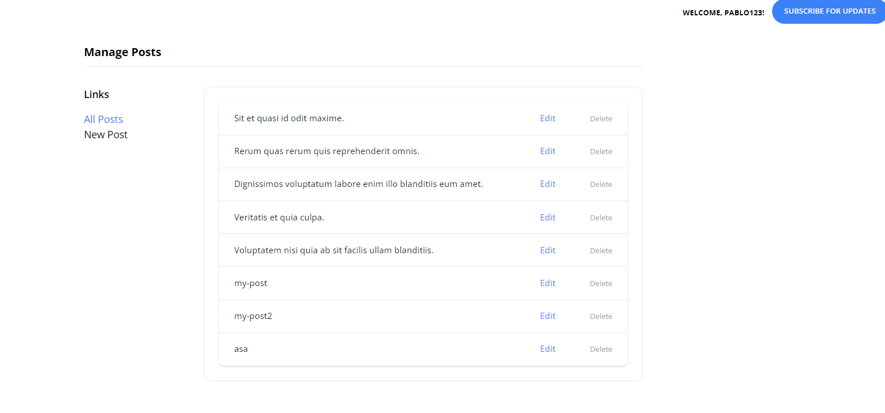
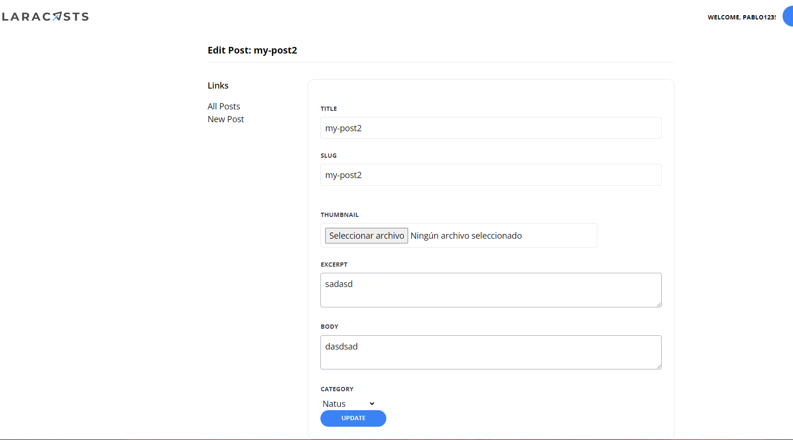

[< Volver al índice](/docs/readme.md)

# Create a Form to Edit and Delete Posts

En este episodio, implementamos la funcionalidad para editar y eliminar publicaciones en nuestro proyecto. A continuación, se detallan los pasos necesarios:

1. **Añadir Rutas en `web.php`:**
   En el archivo `web.php`, añadimos las rutas necesarias para las operaciones de administración:

    ```php
    // Admin
    Route::post('admin/posts', [AdminPostController::class, 'store'])->middleware('admin');
    Route::get('admin/posts/create', [AdminPostController::class, 'create'])->middleware('admin');
    Route::get('admin/posts', [AdminPostController::class, 'index'])->middleware('admin');
    Route::get('admin/posts/{post}/edit', [AdminPostController::class, 'edit'])->middleware('admin');
    Route::patch('admin/posts/{post}', [AdminPostController::class, 'update'])->middleware('admin');
    Route::delete('admin/posts/{post}', [AdminPostController::class, 'destroy'])->middleware('admin');
    ```

2. **Crear `AdminPostController`:**
   En la máquina virtual, creamos un nuevo controlador llamado `AdminPostController` con el siguiente comando:

    ```bash
    php artisan make:controller AdminPostController
    ```

3. **Añadir Código en `AdminPostController.php`:**
   En el archivo `AdminPostController.php`, añadimos el siguiente código:

    ```php
    <?php

    namespace App\Http\Controllers;

    use App\Models\Post;
    use Illuminate\Validation\Rule;

    class AdminPostController extends Controller
    {
        public function index()
        {
            return view('admin.posts.index', [
                'posts' => Post::paginate(50)
            ]);
        }

        public function create()
        {
            return view('admin.posts.create');
        }

        public function store()
        {
            $attributes = request()->validate([
                'title' => 'required',
                'thumbnail' => 'required|image',
                'slug' => ['required', Rule::unique('posts', 'slug')],
                'excerpt' => 'required',
                'body' => 'required',
                'category_id' => ['required', Rule::exists('categories', 'id')]
            ]);

            $attributes['user_id'] = auth()->id();
            $attributes['thumbnail'] = request()->file('thumbnail')->store('thumbnails');

            Post::create($attributes);

            return redirect('/');
        }

        public function edit(Post $post)
        {
            return view('admin.posts.edit', ['post' => $post]);
        }

        public function update(Post $post)
        {
            $attributes = request()->validate([
                'title' => 'required',
                'thumbnail' => 'image',
                'slug' => ['required', Rule::unique('posts', 'slug')->ignore($post->id)],
                'excerpt' => 'required',
                'body' => 'required',
                'category_id' => ['required', Rule::exists('categories', 'id')]
            ]);

            if (isset($attributes['thumbnail'])) {
                $attributes['thumbnail'] = request()->file('thumbnail')->store('thumbnails');
            }

            $post->update($attributes);

            return back()->with('success', 'Post Updated!');
        }

        public function destroy(Post $post)
        {
            $post->delete();

            return back()->with('success', 'Post Deleted!');
        }
    }
    ```

4. **Mover y Modificar `create.blade.php`:**
   Movemos el archivo `create.blade.php` de la carpeta `components` a la carpeta `posts` y añadimos el atributo `required`:

    ```php
    <x-layout>
        <x-setting heading="Publish New Post">
            <form method="POST" action="/admin/posts" enctype="multipart/form-data">
                @csrf

                <x-form.input name="title" required />
                <x-form.input name="slug" required />
                <x-form.input name="thumbnail" type="file" required />
                <x-form.textarea name="excerpt" required />
                <x-form.textarea name="body" required />

                <x-form.field>
                    <x-form.label name="category" />

                    <select name="category_id" id="category_id" required>
                        @foreach (\App\Models\Category::all() as $category)
                        <option value="{{ $category->id }}" {{ old('category_id') == $category->id ? 'selected' : '' }}>{{ ucwords($category->name) }}</option>
                        @endforeach
                    </select>

                    <x-form.error name="category" />
                </x-form.field>

                <x-form.button>Publish</x-form.button>
            </form>
        </x-setting>
    </x-layout>
    ```

5. **Modificar `layout.blade.php`:**
   Modificamos el componente `<x-dropdown-item>` en `layout.blade.php`:

    ```php
    <x-dropdown-item href="/admin/posts" :active="request()->is('admin/posts')">Dashboard</x-dropdown-item>
    ```

6. **Modificar `setting.blade.php`:**
   En `setting.blade.php`, añadimos un estilo adicional al componente `<aside>` y editamos el componente `<a href="/admin/dashboard"`:

    ```php
    <aside class="w-48 flex-shrink-0">
    ```

    ```php
    <a href="/admin/posts" class="{{ request()->is('admin/posts') ? 'text-blue-500' : '' }}">All Posts</a>
    ```

7. **Crear y Modificar `edit.blade.php`:**
   Duplicamos el archivo `create.blade.php`, lo renombramos a `edit.blade.php` y modificamos el código:

    ```php
    <x-layout>
        <x-setting :heading="'Edit Post: ' . $post->title">
            <form method="POST" action="/admin/posts/{{ $post->id }}" enctype="multipart/form-data">
                @csrf
                @method('PATCH')

                <x-form.input name="title" :value="old('title', $post->title)" required />
                <x-form.input name="slug" :value="old('slug', $post->slug)" required />

                <div class="flex mt-6">
                    <div class="flex-1">
                        <x-form.input name="thumbnail" type="file" :value="old('thumbnail', $post->thumbnail)" />
                    </div>

                    thumbnail) }}" alt="" class="rounded-xl ml-6" width="100">
                </div>

                <x-form.textarea name="excerpt" required>{{ old('excerpt', $post->excerpt) }}</x-form.textarea>
                <x-form.textarea name="body" required>{{ old('body', $post->body) }}</x-form.textarea>

                <x-form.field>
                    <x-form.label name="category"/>

                    <select name="category_id" id="category_id" required>
                        @foreach (\App\Models\Category::all() as $category)
                            <option
                                value="{{ $category->id }}"
                                {{ old('category_id', $post->category_id) == $category->id ? 'selected' : '' }}
                            >{{ ucwords($category->name) }}</option>
                        @endforeach
                    </select>

                    <x-form.error name="category"/>
                </x-form.field>

                <x-form.button>Update</x-form.button>
            </form>
        </x-setting>
    </x-layout>
    ```

8. **Modificar `input.blade.php`:**
   Editamos `input.blade.php` de la siguiente manera:

    ```php
    @props(['name'])

    <x-form.field>
        <x-form.label name="{{ $name }}"/>

        <input class="border border-gray-200 p-2 w-full rounded"
               name="{{ $name }}"
               id="{{ $name }}"
               {{ $attributes(['value' => old($name)]) }}
        >

        <x-form.error name="{{ $name }}"/>
    </x-form.field>
    ```

9. **Modificar `textarea.blade.php`:**
   Editamos `textarea.blade.php` de la siguiente manera:

    ```php
    @props(['name'])

    <x-form.field>
        <x-form.label name="{{ $name }}" />

        <textarea
            class="border border-gray-400 p-2 w-full rounded"
            name="{{ $name }}"
            id="{{ $name }}"
            required
            {{ $attributes }}
        >{{ $slot ?? old($name) }}</textarea>

        <x-form.error name="{{ $name }}" />
    </x-form.field>
    ```

10. **Modificar `post-featured-card.blade.php`:**
    Eliminamos el componente `<a>` dentro de `<div class="space-x-2">` y añadimos lo siguiente:

    ```php
    <x-category-button :category="$post->category" />
    ```

11. **Modificar `create.blade.php` de `register` y `sessions`:**
    Añadimos `required` a los atributos en `create.blade.php` de la carpeta `register`:

    ```php
    <x-layout>
        <section class="px-6 py-8">
            <main class="max-w-lg mx-auto mt-10">
                <x-panel>
                    <h1 class="text-center font-bold text-xl">Register!</h1>

                    <form method="POST" action="/register" class="mt-10">
                        @csrf

                        <x-form.input name="name" required />
                       

 <x-form.input name="username" required />
                        <x-form.input name="email" type="email" required />
                        <x-form.input name="password" type="password" autocomplete="new-password" required />
                        <x-form.button>Sign Up</x-form.button>
                    </form>
                </x-panel>
            </main>
        </section>
    </x-layout>
    ```

    Y en `create.blade.php` de la carpeta `sessions`:

    ```php
    <x-layout>
        <section class="px-6 py-8">
            <main class="max-w-lg mx-auto mt-10">
                <x-panel>
                    <h1 class="text-center font-bold text-xl">Log In!</h1>
                    <form method="POST" action="/login" class="mt-10">
                        @csrf

                        <x-form.input name="email" type="email" autocomplete="username" required />
                        <x-form.input name="password" type="password" autocomplete="current-password" required />

                        <x-form.button>Log In</x-form.button>
                    </form>
                </x-panel>
            </main>
        </section>
    </x-layout>
    ```

12. **Modificar `category-button.blade.php`:**
    Editamos `category-button.blade.php`:

    ```php
    @props(['category'])

    <a href="/categories/{{ $category->slug }}"
       class="px-3 py-1 border border-blue-300 rounded-full text-blue-300 text-xs uppercase font-semibold"
       style="font-size: 10px"
    >{{ $category->name }}</a>
    ```

13. **Evidencia de la Página Funcionando:**
    Adjuntamos imágenes de la página funcionando:

    
    

# Resumen

En este episodio, agregamos la funcionalidad de edición y eliminación de publicaciones en nuestra aplicación Laravel. Creamos y configuramos el controlador `AdminPostController`, movimos y modificamos vistas, y actualizamos los archivos de configuración y componentes necesarios para soportar estas nuevas funcionalidades. Finalmente, verificamos que la aplicación funciona correctamente con estas nuevas características.