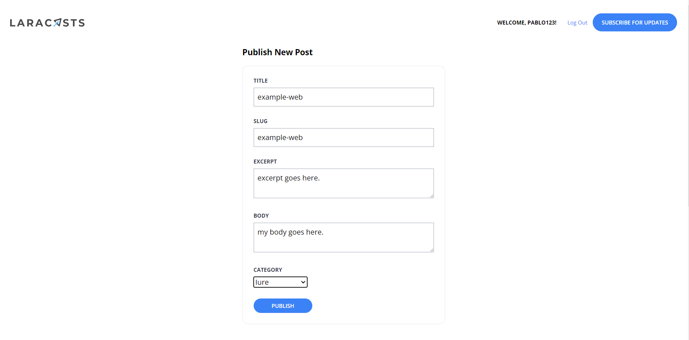
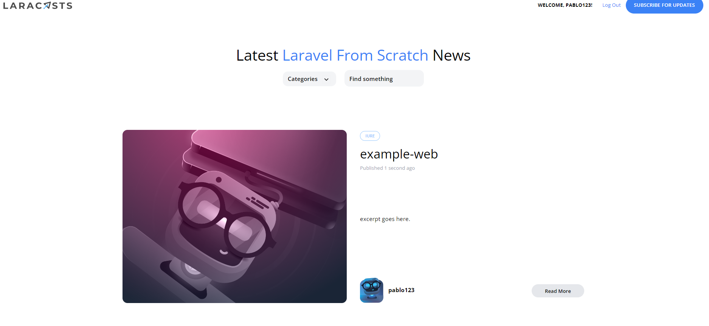

[< Volver al índice](/docs/readme.md)

# Create the Publish Post Form

En este episodio, vamos a completar la creación del formulario "Publish Post" después de haber implementado autorización de ruta en el episodio anterior.

# Pasos :

1. **Modificación del formulario en `create.blade.php`**:
   - Actualizamos el archivo `create.blade.php` para incluir el formulario completo de publicación de posts:

     ```html
     <x-layout>
         <section class="py-8 max-w-md mx-auto">
             <h1 class="text-lg font-bold mb-4">
                 Publicar Nuevo Post
             </h1>

             <x-panel>
                 <form method="POST" action="/admin/posts" enctype="multipart/form-data">
                     @csrf

                     <div class="mb-6">
                         <label class="block mb-2 uppercase font-bold text-xs text-gray-700" for="title">
                             Título
                         </label>
                         <input class="border border-gray-400 p-2 w-full" type="text" name="title" id="title" value="{{ old('title') }}" required>
                         @error('title')
                         <p class="text-red-500 text-xs mt-2">{{ $message }}</p>
                         @enderror
                     </div>

                     <div class="mb-6">
                         <label class="block mb-2 uppercase font-bold text-xs text-gray-700" for="slug">
                             Slug
                         </label>
                         <input class="border border-gray-400 p-2 w-full" type="text" name="slug" id="slug" value="{{ old('slug') }}" required>
                         @error('slug')
                         <p class="text-red-500 text-xs mt-2">{{ $message }}</p>
                         @enderror
                     </div>

                     <div class="mb-6">
                         <label class="block mb-2 uppercase font-bold text-xs text-gray-700" for="excerpt">
                             Extracto
                         </label>
                         <textarea class="border border-gray-400 p-2 w-full" name="excerpt" id="excerpt" required>{{ old('excerpt') }}</textarea>
                         @error('excerpt')
                         <p class="text-red-500 text-xs mt-2">{{ $message }}</p>
                         @enderror
                     </div>

                     <div class="mb-6">
                         <label class="block mb-2 uppercase font-bold text-xs text-gray-700" for="body">
                             Cuerpo
                         </label>
                         <textarea class="border border-gray-400 p-2 w-full" name="body" id="body" required>{{ old('body') }}</textarea>
                         @error('body')
                         <p class="text-red-500 text-xs mt-2">{{ $message }}</p>
                         @enderror
                     </div>

                     <div class="mb-6">
                         <label class="block mb-2 uppercase font-bold text-xs text-gray-700" for="category_id">
                             Categoría
                         </label>
                         <select name="category_id" id="category_id">
                             @foreach (\App\Models\Category::all() as $category)
                             <option value="{{ $category->id }}" {{ old('category_id') == $category->id ? 'selected' : '' }}>{{ ucwords($category->name) }}</option>
                             @endforeach
                         </select>
                         @error('category')
                         <p class="text-red-500 text-xs mt-2">{{ $message }}</p>
                         @enderror
                     </div>

                     <x-submit-button>Publicar</x-submit-button>
                 </form>
             </x-panel>
         </section>
     </x-layout>
     ```

2. **Función `store` en `PostController.php`**:
   - Añadimos la función `store` en `PostController.php` para manejar la creación y almacenamiento del post:

     ```php
     use App\Models\Post;
     use Illuminate\Validation\Rule;

     public function store()
     {
         $attributes = request()->validate([
             'title' => 'required',
             'slug' => ['required', Rule::unique('posts', 'slug')],
             'excerpt' => 'required',
             'body' => 'required',
             'category_id' => ['required', Rule::exists('categories', 'id')]
         ]);

         $attributes['user_id'] = auth()->id();

         Post::create($attributes);

         return redirect('/');
     }
     ```

3. **Verificación en la página web**:

   - Nos aseguramos de que el formulario funcione correctamente al crear un nuevo post en la página web.

     

     Post creado exitosamente.

     

# Resumen

En este episodio, hemos completado la implementación del formulario de publicación de posts. Hemos ajustado `create.blade.php` para incluir todos los campos necesarios y hemos asegurado que el formulario valide correctamente los datos antes de enviarlos al controlador `PostController` para su almacenamiento. Ahora, los administradores pueden crear nuevos posts directamente desde la interfaz de administración, garantizando que la creación de contenido esté restringida solo a usuarios autorizados.