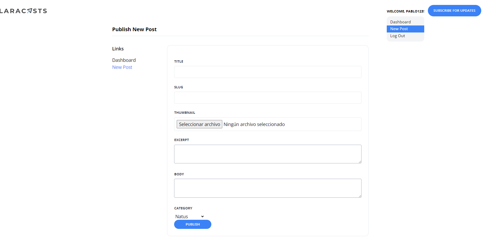

[< Volver al índice](/docs/readme.md)

# Extend the Admin Layout

En este episodio, agregamos un menú desplegable de cuenta al área de navegación y extendemos el diseño de nuestra sección de configuración/administración para permitir una barra lateral.

# Pasos 

1. **Modificación de `layout.blade.php`**:
   - Reemplazamos el componente `<span>` para incluir un menú desplegable de cuenta. El nuevo código es:

     ```php
     <x-dropdown>
         <x-slot name="trigger">
             <button class="text-xs font-bold uppercase">¡Bienvenido, {{ auth()->user()->name }}!</button>
         </x-slot>

         <x-dropdown-item href="/admin/dashboard">Dashboard</x-dropdown-item>
         <x-dropdown-item href="/admin/posts/create" :active="request()->is('admin/posts/create')">Nuevo Post</x-dropdown-item>
         <x-dropdown-item href="#" x-data="{}" @click.prevent="document.querySelector('#logout-form').submit()">Cerrar Sesión</x-dropdown-item>

         <form id="logout-form" method="POST" action="/logout" class="hidden">
             @csrf
         </form>
     </x-dropdown>
     ```

   - Modificamos los componentes `<a>` de registro e inicio de sesión:

     ```php
     <a href="/register" class="text-xs font-bold uppercase {{ request()->is('register') ? 'text-blue-500' : '' }}">Registrarse</a>
     <a href="/login" class="ml-6 text-xs font-bold uppercase {{ request()->is('login') ? 'text-blue-500' : '' }}">Iniciar Sesión</a>
     ```

2. **Modificación de `create.blade.php`**:
   - Actualizamos el código del formulario para utilizar el nuevo componente de configuración:

     ```php
     <x-layout>
         <x-setting heading="Publicar Nuevo Post">
             <form method="POST" action="/admin/posts" enctype="multipart/form-data">
                 @csrf

                 <x-form.input name="title" />
                 <x-form.input name="slug" />
                 <x-form.input name="image" type="file" />
                 <x-form.textarea name="excerpt" />
                 <x-form.textarea name="body" />

                 <x-form.field>
                     <x-form.label name="category" />

                     <select name="category_id" id="category_id">
                         @foreach (\App\Models.Category::all() as $category)
                         <option value="{{ $category->id }}" {{ old('category_id') == $category->id ? 'selected' : '' }}>{{ ucwords($category->name) }}</option>
                         @endforeach
                     </select>

                     <x-form.error name="category" />
                 </x-form.field>

                 <x-form.button>Publicar</x-form.button>
             </form>
         </x-setting>
     </x-layout>
     ```

3. **Creación de `setting.blade.php`**:
   - Creamos el archivo `setting.blade.php` dentro de `components` para manejar los enlaces y añadimos el siguiente código:

     ```php
     @props(['heading'])

     <section class="py-8 max-w-4xl mx-auto">
         <h1 class="text-lg font-bold mb-8 pb-2 border-b">
             {{ $heading }}
         </h1>

         <div class="flex">
             <aside class="w-48">
                 <h4 class="font-semibold mb-4">Enlaces</h4>

                 <ul>
                     <li>
                         <a href="/admin/dashboard" class="{{ request()->is('admin/dashboard') ? 'text-blue-500' : '' }}">Dashboard</a>
                     </li>

                     <li>
                         <a href="/admin/posts/create" class="{{ request()->is('admin/posts/create') ? 'text-blue-500' : '' }}">Nuevo Post</a>
                     </li>
                 </ul>
             </aside>

             <main class="flex-1">
                 <x-panel>
                     {{ $slot }}
                 </x-panel>
             </main>
         </div>
     </section>
     ```

4. **Modificación de `input.blade.php`**:
   - Actualizamos el archivo para mejorar el diseño del campo de entrada:

     ```php
     @props(['name'])

     <x-form.field>
         <x-form.label name="{{ $name }}"/>

         <input class="border border-gray-200 p-2 w-full rounded"
                name="{{ $name }}"
                id="{{ $name }}"
                value="{{ old($name) }}"
                required
                {{ $attributes }}
         >

         <x-form.error name="{{ $name }}"/>
     </x-form.field>
     ```

5. **Modificación de `textarea.blade.php`**:
   - Actualizamos el archivo para mejorar el diseño del área de texto:

     ```php
     @props(['name'])

     <x-form.field>
         <x-form.label name="{{ $name }}" />

         <textarea
             class="border border-gray-400 p-2 w-full rounded"
             name="{{ $name }}"
             id="{{ $name }}"
             required
             {{ $attributes }}
         >{{ old($name) }}</textarea>

         <x-form.error name="{{ $name }}" />
     </x-form.field>
     ```

6. **Modificación de `create.blade.php` en la carpeta `register`**:
   - Editamos el archivo para usar los nuevos componentes:

     ```php
     <x-layout>
         <section class="px-6 py-8">
             <main class="max-w-lg mx-auto mt-10">
                 <x-panel>
                     <h1 class="text-center font-bold text-xl">¡Regístrate!</h1>

                     <form method="POST" action="/register" class="mt-10">
                         @csrf

                         <x-form.input name="name" />
                         <x-form.input name="username" />
                         <x-form.input name="email" type="email" />
                         <x-form.input name="password" type="password" autocomplete="new-password" />
                         <x-form.button>Registrarse</x-form.button>
                     </form>
                 </x-panel>
             </main>
         </section>
     </x-layout>
     ```

7. **Modificación de `create.blade.php` en la carpeta `sessions`**:
   - Editamos el archivo para usar los nuevos componentes:

     ```php
     <x-layout>
         <section class="px-6 py-8">
             <main class="max-w-lg mx-auto mt-10">
                 <x-panel>
                     <h1 class="text-center font-bold text-xl">¡Inicia Sesión!</h1>
                     <form method="POST" action="/login" class="mt-10">
                         @csrf

                         <x-form.input name="email" type="email" autocomplete="username" />
                         <x-form.input name="password" type="password" autocomplete="current-password" />

                         <x-form.button>Iniciar Sesión</x-form.button>
                     </form>
                 </x-panel>
             </main>
         </section>
     </x-layout>
     ```

8. **Modificación de `dropdown.blade.php`**:
   - Añadimos una clase al `<div x-data>`:

     ```php
     <div x-data="{ show: false }" @click.away="show = false" class="relative">
     ```

### Verificación:

Finalmente, verificamos que todo funcione correctamente en la página.



# Resumen

En este episodio, hemos extendido el diseño de la administración agregando un menú desplegable de cuenta y una barra lateral en la sección de configuración. Esto se logra utilizando componentes Blade reutilizables, mejorando así la organización y la experiencia del usuario en el sistema de administración.