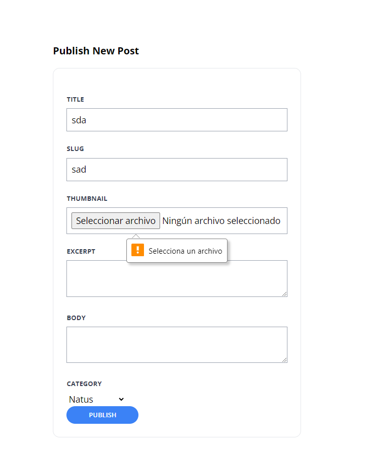

[< Volver al índice](/docs/readme.md)

# Extract Form-Specific Blade Components

En este episodio, limpiamos el HTML de un formulario extrayendo "piezas" reutilizables para construir cada sección. Usaremos componentes Blade para lograr esto.

# Pasos:

1. **Modificación de `create.blade.php`**:
   - Reemplazamos los `<div>` de cada atributo con componentes Blade específicos para lograr un código más limpio y ordenado. Así queda el archivo:

     ```php
     <x-layout>
         <section class="py-8 max-w-md mx-auto">
             <h1 class="text-lg font-bold mb-4">
                 Publicar Nuevo Post
             </h1>

             <x-panel>
                 <form method="POST" action="/admin/posts" enctype="multipart/form-data">
                     @csrf

                     <x-form.input name="title" />
                     <x-form.input name="slug" />
                     <x-form.input name="image" type="file" />
                     <x-form.textarea name="excerpt" />
                     <x-form.textarea name="body" />

                     <x-form.field>
                         <x-form.label name="category" />

                         <select name="category_id" id="category_id">
                             @foreach (\App\Models\Category::all() as $category)
                             <option value="{{ $category->id }}" {{ old('category_id') == $category->id ? 'selected' : '' }}>{{ ucwords($category->name) }}</option>
                             @endforeach
                         </select>

                         <x-form.error name="category" />
                     </x-form.field>
                     <x-form.button>Publicar</x-form.button>
                 </form>
             </x-panel>
         </section>
     </x-layout>
     ```

2. **Creación de componentes Blade**:
   - Creamos una carpeta llamada `form` dentro de `components` y agregamos los siguientes archivos:

     * `input.blade.php`:
       ```php
       @props(['name', 'type' => 'text'])

       <x-form.field>
           <x-form.label name="{{ $name }}"/>

           <input class="border border-gray-400 p-2 w-full"
                  type="{{ $type }}"
                  name="{{ $name }}"
                  id="{{ $name }}"
                  value="{{ old($name) }}"
                  required
           >

           <x-form.error name="{{ $name }}"/>
       </x-form.field>
       ```

     * `error.blade.php`:
       ```php
       @props(['name'])

       @error($name)
       <p class="text-red-500 text-xs mt-2">{{ $message }}</p>
       @enderror
       ```

     * `textarea.blade.php`:
       ```php
       @props(['name'])

       <x-form.field>
           <x-form.label name="{{ $name }}" />

           <textarea
               class="border border-gray-400 p-2 w-full"
               name="{{ $name }}"
               id="{{ $name }}"
               required
           >{{ old($name) }}</textarea>

           <x-form.error name="{{ $name }}" />
       </x-form.field>
       ```

     * `label.blade.php`:
       ```php
       @props(['name'])

       <label class="block mb-2 uppercase font-bold text-xs text-gray-700"
              for="{{ $name }}"
       >
           {{ ucwords($name) }}
       </label>
       ```

     * `field.blade.php`:
       ```php
       <div class="mt-6">
           {{ $slot }}
       </div>
       ```

3. **Reubicación de `submit-button.blade.php`**:
   - Movemos `submit-button.blade.php` a la carpeta `form` y le cambiamos el nombre a `button.blade.php`.

4. **Actualización de `_add-comment-form.blade.php`**:
   - Editamos el botón de envío para utilizar el nuevo componente:

     ```php
     <x-form.button>Enviar</x-form.button>
     ```

# Verificación:

Finalmente, verificamos que la página funcione correctamente.



# Resumen

En este episodio, hemos limpiado el HTML del formulario de creación de posts mediante la extracción de componentes Blade reutilizables. Hemos creado componentes específicos para inputs, textareas, labels, y errores, mejorando así la organización y mantenibilidad del código. Además, hemos asegurado que todo funcione correctamente realizando una verificación en la página web.