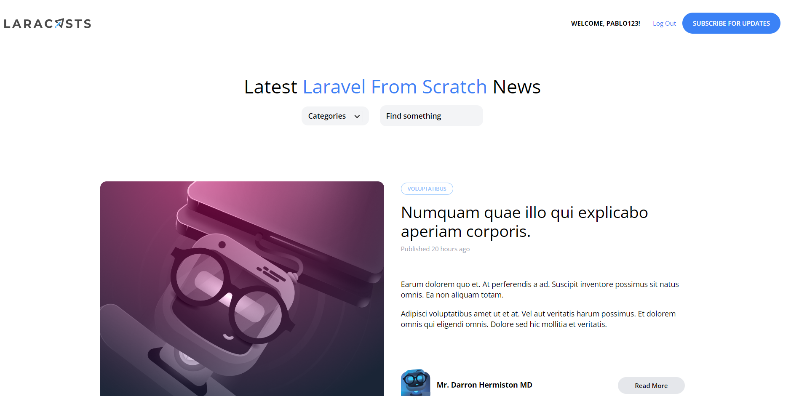
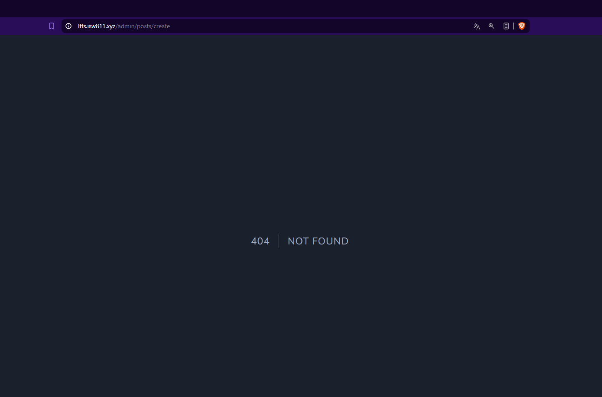

[< Volver al índice](/docs/readme.md)


# Limit Access to Only Admins

Finalmente vamos a trabajar en la sección de administración para publicar nuevos posts. Antes de comenzar a construir el formulario, primero asegurémonos de agregar la capa de autorización necesaria para garantizar que solo los administradores puedan acceder a esta parte del sitio.

# Pasos detallados:

1. **Configuración de rutas**:
   - En el archivo `web.php`, agregamos las siguientes rutas para administradores:

     ```php
     use App\Http\Controllers\PostController;

     Route::get('admin/posts/create', [PostController::class, 'create'])->middleware('admin');
     Route::post('admin/posts', [PostController::class, 'store'])->middleware('admin');
     ```

2. **Controlador de Posts**:
   - En `PostController.php`, añadimos métodos para la creación y almacenamiento de posts:

     ```php
     use App\Models\Post;
     use Illuminate\Validation\Rule;

     public function create()
     {
         return view('posts.create');
     }

     public function store()
     {
         $attributes = request()->validate([
             'title' => 'required',
             'slug' => ['required', Rule::unique('posts', 'slug')],
             'excerpt' => 'required',
             'body' => 'required',
             'category_id' => ['required', Rule::exists('categories', 'id')]
         ]);

         $attributes['user_id'] = auth()->id();

         Post::create($attributes);

         return redirect('/');
     }
     ```

3. **Middleware para Administradores**:
   - Creamos un middleware llamado `MustBeAdministrator` para verificar los permisos de administrador:

     ```bash
     php artisan make:middleware MustBeAdministrator
     ```

     En `MustBeAdministrator.php`, añadimos la lógica para permitir solo a los administradores acceder:

     ```php
     <?php

     namespace App\Http\Middleware;

     use Closure;
     use Illuminate\Http\Request;
     use Symfony\Component\HttpFoundation\Response;

     class MustBeAdministrator
     {
         public function handle(Request $request, Closure $next)
         {
             if (auth()->user()?->username !== 'pablo123') {
                 abort(Response::HTTP_FORBIDDEN);
             }

             return $next($request);
         }
     }
     ```

4. **Configuración en `Kernel.php`**:
   - Registramos el middleware en `Kernel.php` bajo `$routeMiddleware`:

     ```php
     'admin' => MustBeAdministrator::class,
     ```

5. **Vista para Crear Posts**:
   - Creamos una nueva vista `create.blade.php` en la carpeta `posts` para el formulario de creación de posts:

     ```php
     <x-layout>
         <section class="px-6 py-8">
             <x-panel class="max-w-sm mx-auto">
                 <form method="POST" action="/admin/posts">
                     @csrf

                     <!-- Campos del formulario -->

                     <x-submit-button>Publish</x-submit-button>
                 </form>
             </x-panel>
         </section>
     </x-layout>
     ```

6. **Actualización en `RegisterController`**:
   - En `RegisterController`, aseguramos que solo los administradores puedan registrarse automáticamente:

     ```php
     auth()->login(User::create($attributes));
     ```

**Admin**




 


# Resumen

En este episodio, hemos implementado medidas para limitar el acceso a ciertas partes del sitio web solo a los administradores. Configuramos rutas protegidas con middleware, creamos un middleware personalizado para verificar el rol de administrador, y aseguramos que solo usuarios específicos puedan acceder a la creación de posts en el panel de administración. Además, hemos actualizado el proceso de registro para garantizar que solo los administradores puedan registrarse automáticamente.