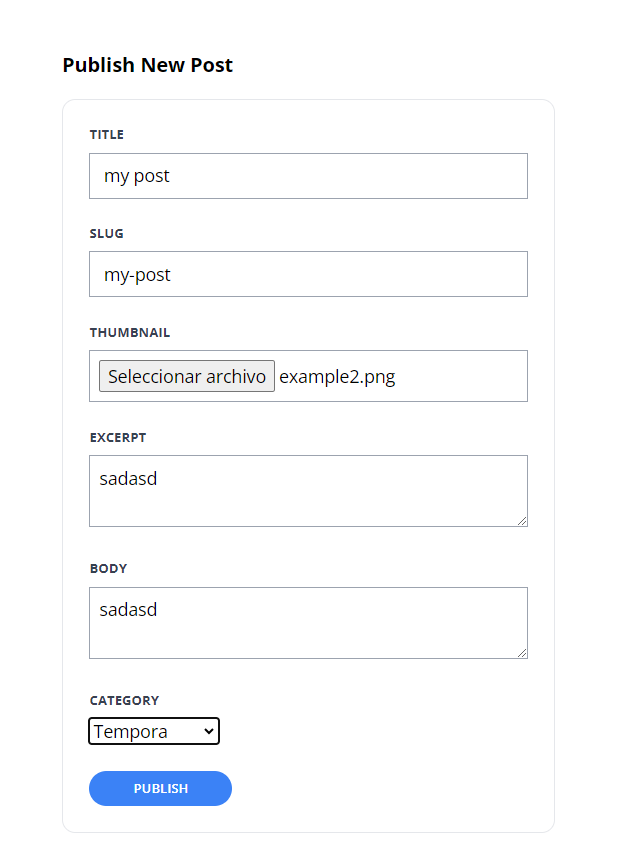

[< Volver al índice](/docs/readme.md)


# Validate and Store Post Images

En este episodio, nos enfocaremos en la validación y almacenamiento de imágenes para los posts utilizando Laravel y la clase UploadedFile.

# Pasos detallados:

1. **Modificación de `create.blade.php`**:
   - Agregamos un nuevo campo de entrada de archivo para la imagen debajo del campo `slug` en el formulario de creación de posts:

     ```html
     <div class="mb-6">
         <label class="block mb-2 uppercase font-bold text-xs text-gray-700" for="image">
             Imagen
         </label>

         <input class="border border-gray-400 p-2 w-full" type="file" name="image" id="image" required>

         @error('image')
         <p class="text-red-500 text-xs mt-2">{{ $message }}</p>
         @enderror
     </div>
     ```

2. **Actualización de validación en `PostController.php`**:
   - Añadimos la validación para el campo `image` debajo del campo `title` en el método `store` de `PostController.php`:

     ```php
     $attributes = request()->validate([
         'title' => 'required',
         'slug' => ['required', Rule::unique('posts', 'slug')],
         'excerpt' => 'required',
         'body' => 'required',
         'category_id' => ['required', Rule::exists('categories', 'id')],
         'image' => 'required|image', // Validación para la imagen
     ]);
     ```

3. **Almacenamiento de la imagen**:
   - Añadimos el código para almacenar la imagen subida dentro del método `store` en `PostController.php`, debajo de la asignación de `user_id`:

     ```php
     $attributes['image'] = request()->file('image')->store('images');
     ```

4. **Configuración del sistema de archivos**:
   - En el archivo `filesystems.php`, cambiamos la configuración de `local` a `public` para asegurar que las imágenes sean accesibles públicamente:

     ```php
     'default' => env('FILESYSTEM_DRIVER', 'public'),
     ```

5. **Actualización del esquema de la base de datos**:
   - En el archivo de migración `create_posts_table.php`, agregamos un nuevo campo para almacenar la ruta de la imagen:

     ```php
     $table->string('image')->nullable();
     ```

6. **Migración y relleno de datos**:
   - Ejecutamos el comando `migrate:fresh --seed` en la máquina virtual para eliminar y recrear las tablas de la base de datos con los cambios realizados y llenar datos de prueba si es necesario.

     ```bash
     php artisan migrate:fresh --seed
     ```

7. **Actualización de las vistas**:
   - Modificamos las vistas `show.blade.php`, `post-card.blade.php` y `post-featured-card.blade.php` para mostrar la imagen del post utilizando la nueva ruta almacenada:

     ```php
     image) }}" alt="Imagen del post" class="rounded-xl">
     ```

8. **Verificación en la página web**:
   - Finalmente, verificamos que la funcionalidad de carga y visualización de imágenes funcione correctamente en la página web.

     


# Resumen 

En este episodio, hemos implementado la capacidad de cargar imágenes para los posts. Hemos ajustado tanto el formulario de creación como el controlador para manejar la validación y almacenamiento de imágenes utilizando Laravel. Además, hemos asegurado que las imágenes sean accesibles públicamente modificando la configuración del sistema de archivos y actualizando las vistas necesarias para mostrar correctamente las imágenes de los posts creados. Ahora, los usuarios pueden enriquecer sus posts con imágenes, mejorando la experiencia visual en la página web.