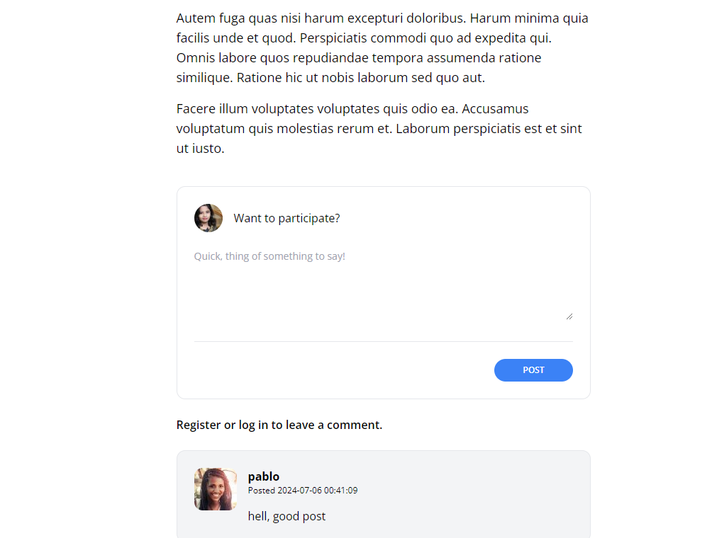

[< Volver al índice](/docs/readme.md)

# Activate the Comment Form


Ahora que el formulario de comentarios está completamente diseñado, en este episodio agregaremos la lógica necesaria para activarlo.

Crear el controlador de comentarios:

Comenzamos creando un nuevo archivo controlador dentro de la carpeta `Controller` llamado `PostCommentsController.php` y añadimos el siguiente código:

```php

<?php

namespace App\Http\Controllers;

use App\Models\Post;
use Illuminate\Http\Request;

class PostCommentsController extends Controller
{
    public function store(Post $post)
    {
        request()->validate([
            'body' => 'required'
        ]);

        $post->comments()->create([
            'user_id' => request()->user()->id,
            'body' => request('body')
        ]);

        return back();
    }
}
```

Actualizar el proveedor de servicios:

Nos dirigimos al archivo `AppServiceProvider.php` y agregamos lo siguiente a la función boot:

```php

Model::unguard();

```

Vamos al archivo `show.blade.php` y envolvemos el componente `<x-panel>` con  @auth y @endauth` para asegurarnos de que solo los usuarios autenticados puedan ver el formulario de comentarios:

```html

@auth
    <x-panel>
        <form method="POST" action="/posts/{{ $post->slug }}/comments">
            @csrf

            <header class="flex items-center">
                id() }}"
                     alt=""
                     width="40"
                     height="40"
                     class="rounded-full">
                
                <h2 class="ml-4">Want to participate?</h2>
            </header>

            <div class="mt-6">
                <textarea
                    name="body"
                    class="w-full text-sm focus:outline-none focus:ring"
                    rows="5"
                    placeholder="Quick, think of something to say!"
                    required></textarea>
            </div>

            <div class="flex justify-end mt-6 pt-6 border-t border-gray-200">
                <button type="submit"
                    class="bg-blue-500 text-white uppercase font-semibold text-xs py-2 px-10 rounded-2xl hover:bg-blue-600">
                POST</button>
            </div>
        </form>
    </x-panel>
@endauth

```

Comprobamos que el formulario funciona correctamente en la página web, primero agregando un comentario y luego verificando que se haya añadido:


 

# Resumen
En este episodio, agregamos la lógica necesaria para activar el formulario de comentarios. Creamos un nuevo controlador `PostCommentsController` para manejar el almacenamiento de comentarios, actualizamos el proveedor de servicios para permitir la asignación , y ajustamos la vista del post para que solo los usuarios autenticados puedan ver y usar el formulario de comentarios. Finalmente, verificamos que el formulario funcione correctamente en la página web.