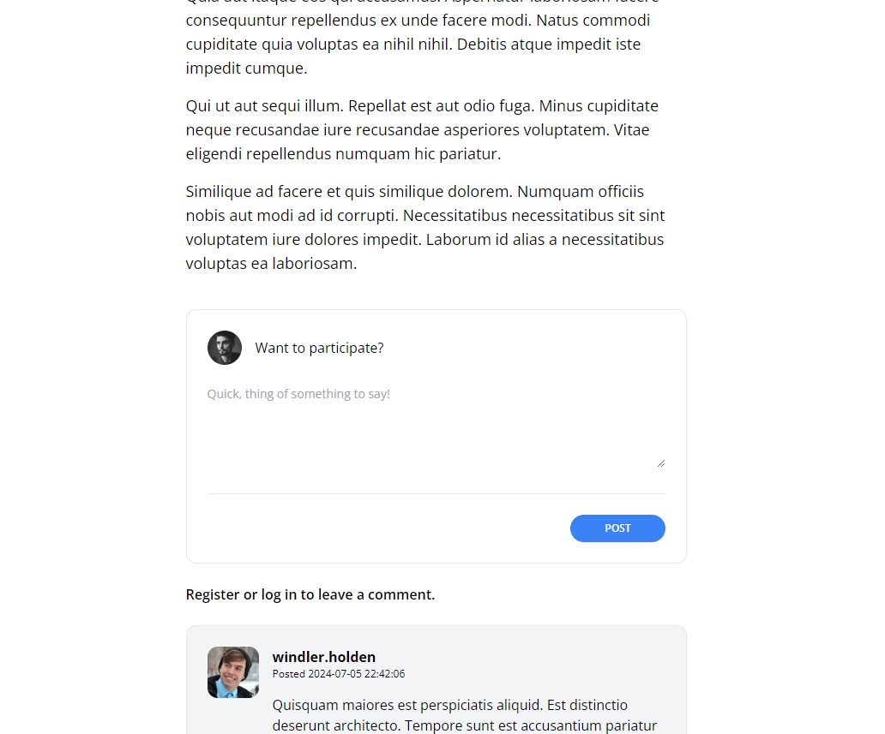

[< Volver al índice](/docs/readme.md)

# Design the Comment Form

Ahora que cada publicación puede mostrar una lista de comentarios, en este episodio vamos a crear un formulario para permitir que cualquier usuario autenticado participe en el post.


Comenzamos creando un nuevo archivo en la carpeta components llamado `panel.blade.php` y añadimos el siguiente código:

```php

<div {{ $attributes(['class' => 'border border-gray-200 p-6 rounded-xl']) }}>
    {{ $slot }}
</div>
```


Nos dirigimos al archivo `show.blade.php` y agregamos el siguiente código dentro del componente section para crear el formulario:

```html

<x-panel>
    <form method="POST" action="/posts/{{ $post->slug }}/comments">
        @csrf

        <header class="flex items-center">
            id() }}"
                 alt=""
                 width="40"
                 height="40"
                 class="rounded-full">
            
            <h2 class="ml-4">Want to participate?</h2>
        </header>

        <div class="mt-6">
            <textarea
                name="body"
                class="w-full text-sm focus:outline-none focus:ring"
                rows="5"
                placeholder="Quick, think of something to say!"
                required></textarea>
        </div>

        <div class="flex justify-end mt-6 pt-6 border-t border-gray-200">
            <button type="submit"
                class="bg-blue-500 text-white uppercase font-semibold text-xs py-2 px-10 rounded-2xl hover:bg-blue-600">
            POST</button>
        </div>
    </form>
</x-panel>
```


Comprobamos que el formulario se muestra correctamente en la página web:

 


# Resumen 

En este episodio, creamos un formulario para permitir que cualquier usuario autenticado pueda participar en comentarios en cada publicación. Para ello, diseñamos un nuevo componente `panel.blade.php` y lo incorporamos en el archivo `show.blade.php` para construir el formulario de comentarios. Finalmente, verificamos que el formulario funcione correctamente en la página web.


