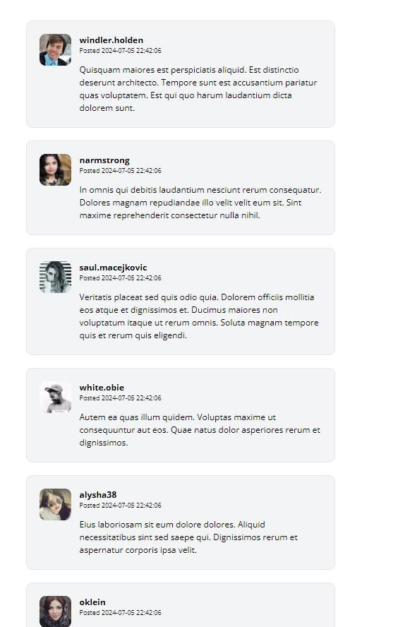

[< Volver al índice](/docs/readme.md)

# Make the Comments Section Dynamics


Ahora que tenemos la tabla de comentarios lista, vamos a configurar y construir los atributos necesarios para nuestro `CommentFactory`. Una vez completado, pasaremos a nuestra página de post y haremos que la sección de comentarios se cargue desde la base de datos.


Ubicamos el archivo `CommentFactory.php` y añadimos los siguientes atributos en la función definition:

```php

'post_id' => Post::factory(),
'user_id' => User::factory(),
'body' => $this->faker->paragraph()

```


Abrimos nuestra máquina virtual y nos ubicamos en `/vagrant/sites/lfts.isw811.xyz`

Ejecutamos el siguiente comando para abrir Tinker:

```bash

php artisan tinker
```
Dentro de Tinker, ejecutamos el siguiente comando para crear datos en la tabla de comentarios:

```bash

App\Models\Comment::factory()->create();

```


Ubicamos el archivo `Post.php` y añadimos la siguiente función comments debajo de la función scopeFilter:

```php

public function comments()
{
    return $this->hasMany(Comment::class);
}

```


Ubicamos el archivo `Comments.php` y creamos las funciones post y author para asociar los comentarios con los posts y los autores:

```php

public function post()
{
    return $this->belongsTo(Post::class);
}

public function author()
{
    return $this->belongsTo(User::class, 'user_id');
}
```


Ubicamos el archivo `show.blade.php` y editamos el componente section agregando un @foreach para iterar sobre los comentarios:

```html

@foreach ($post->comments as $comment)
    <x-post-comment :comment="$comment" />
@endforeach

```


Ubicamos el archivo `post-comment.blade.php` y editamos los componentes `, <h3/>, <time/> y <p/>` para mostrar datos dinámicos:

```php

<article class="flex bg-gray-100 border border-gray-200 p-6 rounded-xl space-x-4">
    <div class="flex-shrink-0">
        id }}" alt="" width="60" height="60" class="rounded-xl">
    </div>

    <div>
        <header class="mb-4">
            <h3 class="font-bold">{{ $comment->author->username }}</h3>

            <p class="text-xs">
                Posted
                <time>{{ $comment->created_at }}</time>
            </p>
        </header>

        <p>
            {{ $comment->body }}
        </p>
    </div>
</article>
```


Volvemos a nuestra máquina virtual y abrimos otra vez Tinker. Ejecutamos el siguiente comando para crear 10 comentarios en un solo post por medio del id:

```bash

App\Models\Comment::factory(10)->create(['post_id' => 37]);

```


Comprobamos que los comentarios se muestran correctamente en la página web:


 

# Resumen 
En este episodio, configuramos y construimos los atributos necesarios para nuestro CommentFactory, y ajustamos nuestro modelo de Post y Comment para manejar las relaciones adecuadamente. Luego, actualizamos nuestra vista de post para cargar y mostrar los comentarios desde la base de datos, verificando que todo funcione correctamente.