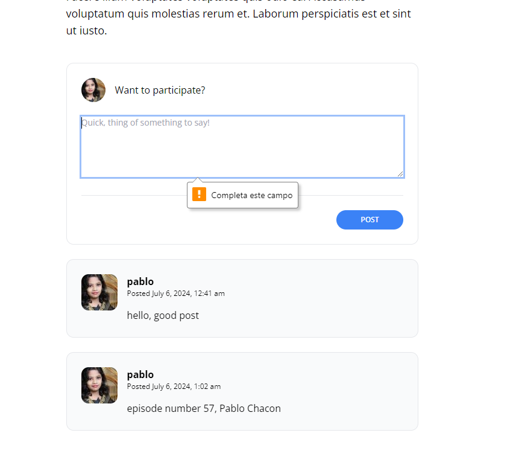

[< Volver al índice](/docs/readme.md)

# Some Light Chapter Clean Up


En este episodio, extraeremos un par de componentes de Blade, crearemos un archivo de inclusión en PHP y luego reformatearemos manualmente algunas partes de nuestro código.

1. **Extraer el formulario de comentarios**:
   - Nos dirigimos al archivo `show.blade.php` y cortamos todo el contenido dentro del componente `@auth`.

2. **Crear un nuevo archivo para el formulario**:
   - Creamos un nuevo archivo dentro de la carpeta `posts` llamado `_add-comment-form.blade.php` y pegamos el código previamente cortado:

     ```html
     @auth
         <x-panel>
             <form method="POST" action="/posts/{{ $post->slug }}/comments">
                 @csrf

                 <header class="flex items-center">
                     id() }}"
                          alt=""
                          width="40"
                          height="40"
                          class="rounded-full">

                     <h2 class="ml-4">Want to participate?</h2>
                 </header>

                 <div class="mt-6">
                     <textarea
                         name="body"
                         class="w-full text-sm focus:outline-none focus:ring"
                         rows="5"
                         placeholder="Quick, think of something to say!"
                         required></textarea>

                     @error('body')
                         <span class="text-xs text-red-500">{{ $message }}</span>
                     @enderror
                 </div>

                 <div class="flex justify-end mt-6 pt-6 border-t border-gray-200">
                     <button type="submit"
                         class="bg-blue-500 text-white uppercase font-semibold text-xs py-2 px-10 rounded-2xl hover:bg-blue-600">
                         POST
                     </button>
                 </div>
             </form>
         </x-panel>
     @else
         <p class="font-semibold">
             <a href="/register" class="hover:underline">Register</a> or
             <a href="/login" class="hover:underline">log in</a> to leave a comment.
         </p>
     @endauth
     ```

3. **Incluir el formulario en `show.blade.php`**:
   - Volvemos al archivo `show.blade.php` y agregamos la siguiente línea de código donde cortamos el formulario anterior:

     ```php
     @include('posts._add-comment-form')
     ```

4. **Extraer el botón de envío**:
   - En el archivo `_add-comment-form.blade.php`, cortamos el componente `<button>`.

5. **Crear un nuevo componente para el botón**:
   - Creamos un nuevo archivo dentro de la carpeta `components` llamado `submit-button.blade.php` y pegamos el componente `<button>`, agregando también lo siguiente:

     ```html
     <button type="submit"
             class="bg-blue-500 text-white uppercase font-semibold text-xs py-2 px-10 rounded-2xl hover:bg-blue-600">
         {{ $slot }}
     </button>
     ```

6. **Actualizar el componente de comentario**:
   - Nos dirigimos al archivo `post-comment.blade.php` y lo editamos con el siguiente código:

     ```html
     @props(['comment'])
     <x-panel class="bg-gray-50">
         <article class="flex space-x-4">
             <div class="flex-shrink-0">
                 user_id }}" alt="" width="60" height="60" class="rounded-xl">
             </div>

             <div>
                 <header class="mb-4">
                     <h3 class="font-bold">{{ $comment->author->username }}</h3>

                     <p class="text-xs">
                         Posted
                         <time>{{ $comment->created_at->format('F j, Y, g:i a') }}</time>
                     </p>
                 </header>

                 <p>
                     {{ $comment->body }}
                 </p>
             </div>
         </article>
     </x-panel>
     ```

7. **Verificar en la página web**:
   - Comprobamos que todo funcione correctamente en la página web:

     

---

# Resumen 

En este episodio, limpiamos el código extrayendo el formulario de comentarios y el botón de envío a componentes separados. Creamos el archivo de inclusión `_add-comment-form.blade.php` para el formulario de comentarios y `submit-button.blade.php` para el botón de envío. También reformateamos el componente de comentario en `post-comment.blade.php`. Finalmente, verificamos que todo funcione correctamente en la página web.

