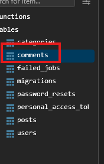

[< Volver al índice](/docs/readme.md)

# Table Consistency and Foreign Key Constraints

 En este episodio, procederemos a crear la migración y la tabla correspondiente para nuestros comentarios. Esto nos permitirá discutir las restricciones de claves externas.


Primero, abrimos la máquina virtual y  en `/vagrant/sites/lfts.isw811.xyz`. Ejecutamos el siguiente comando para crear el modelo, la tabla de migración, el factory y el controlador de los comments:

```bash

php artisan make:model Comment -mfc

```

Luego, abrimos el archivo recién creado `create_comments_table.php` y añadimos los siguientes atributos al Schema::create:

```php

Schema::create('comments', function (Blueprint $table) {
    $table->id();
    $table->foreignId('post_id')->constrained()->cascadeOnDelete();
    $table->foreignId('user_id')->constrained()->cascadeOnDelete();
    $table->text('body');
    $table->timestamps();
});
```
A continuación, editamos el archivo `create_posts_table.php` y modificamos el atributo `user_id` dentro del Schema:

```php

$table->foreignId('user_id')->constrained()->cascadeOnDelete();

```

Finalmente, volvemos a nuestra máquina virtual y ejecutamos el siguiente comando para migrar la nueva tabla de comentarios a la base de datos:

```bash

php artisan migrate

```

Verificamos la base de datos para asegurarnos de que la nueva tabla se ha creado correctamente

 

# Resumen 
En este episodio, hemos creado la migración y la tabla para los comentarios, implementando restricciones de claves externas. Esto garantiza la consistencia de las relaciones entre las tablas y facilita el manejo de los datos relacionados.