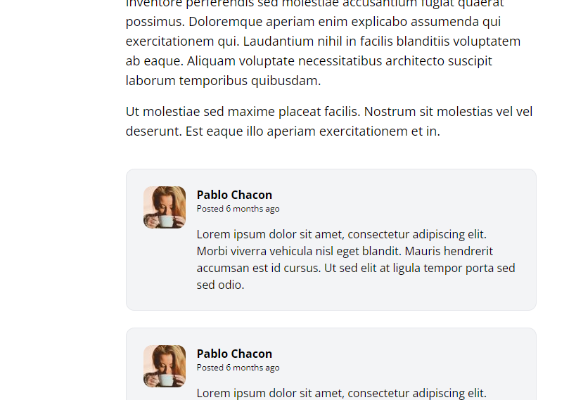

[< Volver al índice](/docs/readme.md)

# Write the Markup for a Post Comment

En este episodio, vamos a trabajar en la funcionalidad de comentarios para las publicaciones. Comenzaremos por crear el marcado base para un comentario. 

Paso 1: Crear el Archivo de Comentario
Primero, crea un nuevo archivo llamado `post-comment.blade.php` dentro de la carpeta `components`, que se encuentra dentro de la carpeta `views`.

Contenido del Archivo `post-comment.blade.php`
Agrega el siguiente código para crear los comentarios en la página:

```html

<article class="flex bg-gray-100 border border-gray-200 p-6 rounded-xl space-x-4">
    <div class="flex-shrink-0">
        
    </div>

    <div>
        <header class="mb-4">
            <h3 class="font-bold">Pablo Chacon</h3>

            <p class="text-xs">
                Posted
                <time>6 months ago</time>
            </p>
        </header>

        <p>
            Lorem ipsum dolor sit amet, consectetur adipiscing elit. Morbi viverra vehicula nisl
            eget blandit. Mauris hendrerit accumsan est id cursus. Ut sed elit at ligula tempor
            porta sed sed odio.
        </p>
    </div>
</article>

```
Paso 2: Integrar el Componente de Comentario
Luego, vamos al archivo `show.blade.php` para incluir el nuevo componente de comentario. Agrega este componente debajo del cierre del siguiente div: <div class="col-span-8">

Actualizar el Archivo `show.blade.php`

```html
<section class="col-span-8 col-start-5 mt-10 space-y-6">
    <x-post-comment />
    <x-post-comment />
    <x-post-comment />
    <x-post-comment />
</section>

```

Por último, verifica los comentarios en la página web para asegurarte de que se renderizan correctamente.

 


# Resumen
En este episodio, creamos la estructura básica para los comentarios en una publicación. Comenzamos creando el archivo `post-comment.blade.php` y luego integramos este componente en la vista principal de la publicación `(show.blade.php)`. Con esta base, ahora podemos proceder a añadir funcionalidad adicional para manejar y mostrar los comentarios dinámicamente en el futuro.


