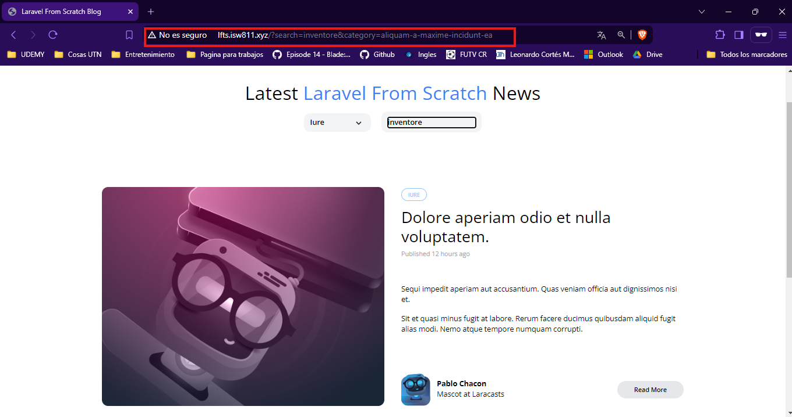

[< Volver al índice](/docs/readme.md)

# Advanced Eloquent Query Constraints

En este episodio, continuaremos mejorando la consulta filter() de nuestro modelo Post para incluir la capacidad de filtrar los mensajes por categoría. Esto nos permitirá combinar múltiples filtros de manera efectiva.

Para empezar, abrimos el archivo `PostController.php` y modificamos el método index() para incluir el filtro de category en el request y agregar currentCategory.

```php

public function index()
{
    return view('posts', [
        'posts' => Post::latest()->filter(request(['search', 'category']))->get(),
        'categories' => Category::all(),
        'currentCategory' => Category::firstWhere('slug', request('category'))
    ]);
}

```
Luego, vamos al archivo `Post.php` y actualizamos la función scopeFilter para incluir el filtro de categoría.

```php

public function scopeFilter($query, array $filters)
{
    $query->when($filters['search'] ?? false, fn($query, $search) =>
        $query->where(fn($query) =>
            $query->where('title', 'like', '%' . $search . '%')
                  ->orWhere('body', 'like', '%' . $search . '%')
        )
    );

    $query->when($filters['category'] ?? false, fn($query, $category) =>
        $query->whereHas('category', fn($query) =>
            $query->where('slug', $category)
        )
    );
}
```
A continuación, eliminamos la ruta categories del archivo`web.php` para evitar redundancias.

Finalmente, vamos al archivo `_posts-header.blade.php` y actualizamos el componente `<x-dropdown-item>` para que el enlace href incluya el filtro de categoría.

```php

<x-dropdown-item href="/?category={{ $category->slug }}" :active='request()->is("categories/{$category->slug}")'>
    {{ ucwords($category->name) }}
</x-dropdown-item>
```

 

# Resumen
En este episodio, hemos ampliado la funcionalidad de filtrado de nuestro modelo Post para incluir la búsqueda por categoría. Al modificar `PostController.php`, `Post.php` y actualizar el componente del menú desplegable en `_posts-header.blade.php`, hemos mejorado la capacidad de búsqueda y filtrado de nuestro blog, haciendo que la funcionalidad sea más robusta y versátil.