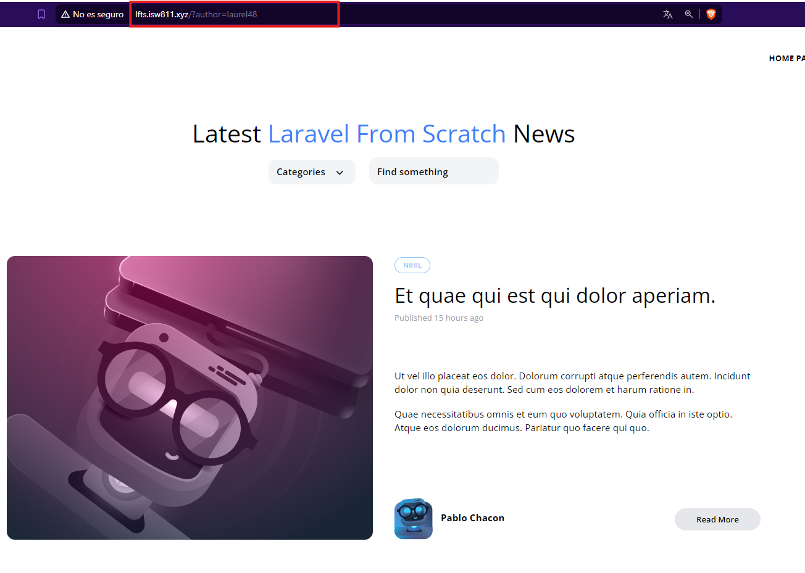

[< Volver al índice](/docs/readme.md)

# Author Filtering

En este episodio, añadiremos la funcionalidad de filtrar publicaciones según su autor. Con esta mejora, podremos ordenar las publicaciones por categoría, autor, texto de búsqueda o una combinación de estos.

Paso 1: Modificar Vistas de Tarjetas de Publicaciones
Primero, editamos los archivos `post-card.blade.php` y `post-featured-card.blade.php` para incluir un enlace al autor en el siguiente `<div class="ml-3">`.

```php

<h5 class="font-bold">
    <a href="/?author={{ $post->author->username }}">{{ $post->author->name }}</a>
</h5>

```
Paso 2: Editar Rutas en `web.php`

En el archivo `web.php`, ajustamos la ruta `Route::get('authors/{author:username}')` para que devuelva la vista posts.index con las publicaciones del autor.

```php

Route::get('authors/{author:username}', function (Author $author) {
    return view('posts.index', [
        'posts' => $author->posts
    ]);
});

```
Paso 3: Actualizar el Modelo `Post.php`
Agregamos la lógica de filtrado por autor en el método scopeFilter del modelo Post.

```php
$query->when($filters['author'] ?? false, fn ($query, $author) =>
    $query->whereHas('author', fn ($query) =>
        $query->where('username', $author)
    )
);
```
Paso 4: Modificar la Vista s`how.blade.php`
En el archivo `show.blade.php`, editamos el siguiente `<div class="ml-3 text-left">` para incluir un enlace al autor.

```html

<h5 class="font-bold">
    <a href="/?author={{ $post->author->username }}">{{ $post->author->name }}</a>
</h5>
```
Paso 5: Revisar Nuevamente las Vistas
Volvemos a los archivos `post-card.blade.php` y `post-featured-card.blade.php` para asegurarnos de que el código dentro del `<div class="ml-3">` esté actualizado con el enlace correcto al autor.

```php

<h5 class="font-bold">
    <a href="/?author={{ $post->author->username }}">{{ $post->author->name }}</a>
</h5>
```
Paso 6: Limpiar las Rutas en `web.php`
Para mantener el código limpio, eliminamos la ruta específica de authors en `web.php`, ya que ahora manejamos el filtrado de autores a través de la ruta principal de publicaciones.


-Resultado
 


# Resumen
En este episodio, hemos añadido la capacidad de filtrar publicaciones por autor, actualizando las vistas de tarjetas de publicaciones y ajustando las rutas y métodos del controlador y modelo para manejar este nuevo filtro.