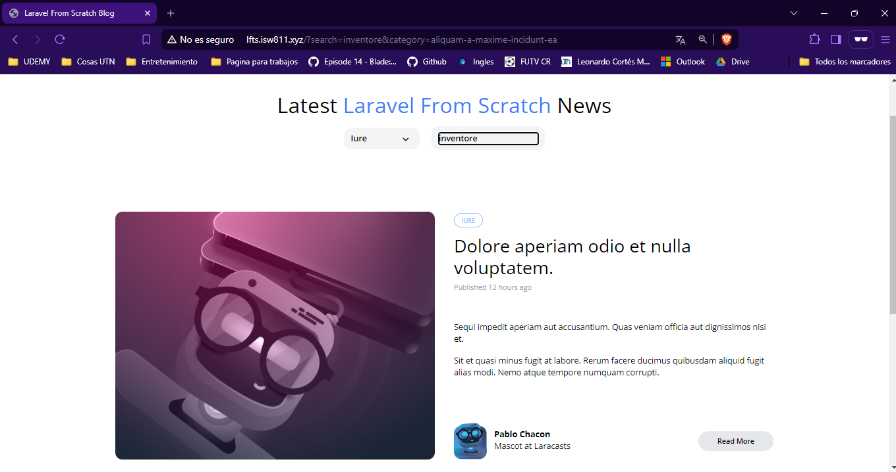

[< Volver al índice](/docs/readme.md)

# Extract a Category Dropdown Blade Component

En este episodio, vamos a crear un componente Blade específico para el menú desplegable de categorías, denominado x-category-dropdown, que manejará la obtención de los datos necesarios para el desplegable.

Paso 1: Crear el Componente
Primero, abrimos nuestra máquina virtual y ejecutamos el siguiente comando para crear un nuevo componente llamado `CategoryDropdown` .

```bash
php artisan make:component CategoryDropdown
```

Paso 2: Modificar `_posts-header.blade.php`
En el archivo `_posts-header.blade.php`, reemplazamos el código del componente x-dropdown con nuestro nuevo componente x-category-dropdown.

```php
<x-category-dropdown />
```

Paso 3: Editar category-dropdown.blade.php
Nos dirigimos al archivo recién creado `category-dropdown.blade.php` y pegamos el código cortado del x-dropdown original.

```php

<x-dropdown>
    <x-slot name="trigger">
        <button class="py-2 pl-3 pr-9 text-sm font-semibold w-full lg:w-32 text-left flex lg:inline-flex">
            {{ isset($currentCategory) ? ucwords($currentCategory->name) : 'Categories' }}
            <x-icon name="down-arrow" class="absolute pointer-events-none" style="right: 12px;" />
        </button>
    </x-slot>

    <x-dropdown-item href="/" :active="request()->routeIs('home')">All</x-dropdown-item>

    @foreach ($categories as $category)
    <x-dropdown-item href="/?category={{ $category->slug }}" :active='request()->is("categories/{$category->slug}")'>
        {{ ucwords($category->name) }}
    </x-dropdown-item>
    @endforeach
</x-dropdown>
```
Paso 4: Modificar `CategoryDropdown.php`
En el archivo `CategoryDropdown.php`, actualizamos el método render para devolver las categorías y la categoría actual. También cortamos currentCategory del archivo `PostController.php`.

```php
public function render()
{
    return view('components.category-dropdown', [
        'categories' => Category::all(),
        'currentCategory' => Category::firstWhere('slug', request('category'))
    ]);
}
```

Paso 5: Actualizar `web.php` y `PostController.php`

Eliminamos la línea `'categories' => Category::all()` de los métodos index y show en `PostController.php` y `web.php`.

Paso 6: Reorganizar Vistas

Creamos una carpeta llamada `posts` dentro de la carpeta views, y movemos los archivos `_posts-header.blade.php`, `post.blade.php` y `posts.blade.php` a esta carpeta. Luego renombramos los archivos de la siguiente manera:

`_posts-header.blade.php` a `_header.blade.php`
`post.blade.php` a `show.blade.php`
`posts.blade.php` a `index.blade.php`

En el archivo `index.blade.php`, actualizamos el @include para reflejar los nuevos nombres.

```php

@include ('posts._header')
```

 

# Resumen
En este episodio, hemos extraído el componente de menú desplegable de categorías en un archivo Blade separado, mejorando la organización y reutilización del código. Además, hemos reorganizado las vistas para mantener una estructura de archivos más limpia y manejable.