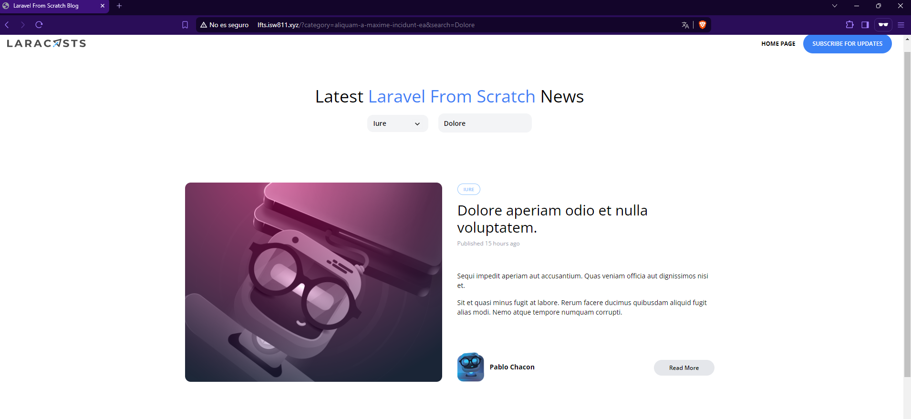

[< Volver al índice](/docs/readme.md)

# Fix a Confusing Eloquent Query Bug

Tenemos un pequeño error en nuestro ámbito de consulta filter().

En este episodio, revisaremos la consulta SQL subyacente que está produciendo resultados incorrectos y corregiremos el error en nuestra consulta Eloquent.

Paso 1: Modificar el Ámbito de Consulta filter()
Primero, vamos al archivo `Post.php` y ajustamos la función scopeFilter para que la consulta de search funcione correctamente.

```php

$query->when($filters['search'] ?? false, fn ($query, $search) =>
    $query->where(fn($query) =>
        $query->where('title', 'like', '%' . $search . '%')
              ->orWhere('body', 'like', '%' . $search . '%')));
```
Paso 2: Verificación
Después de realizar estos cambios, verificamos que la página funcione correctamente y que la búsqueda produzca los resultados esperados.


 

# Resumen
En este episodio, identificamos y corregimos un error en nuestra consulta Eloquent dentro del ámbito `filter()`. Al ajustar la lógica de la consulta, aseguramos que las búsquedas en los títulos y cuerpos de las publicaciones funcionen correctamente.