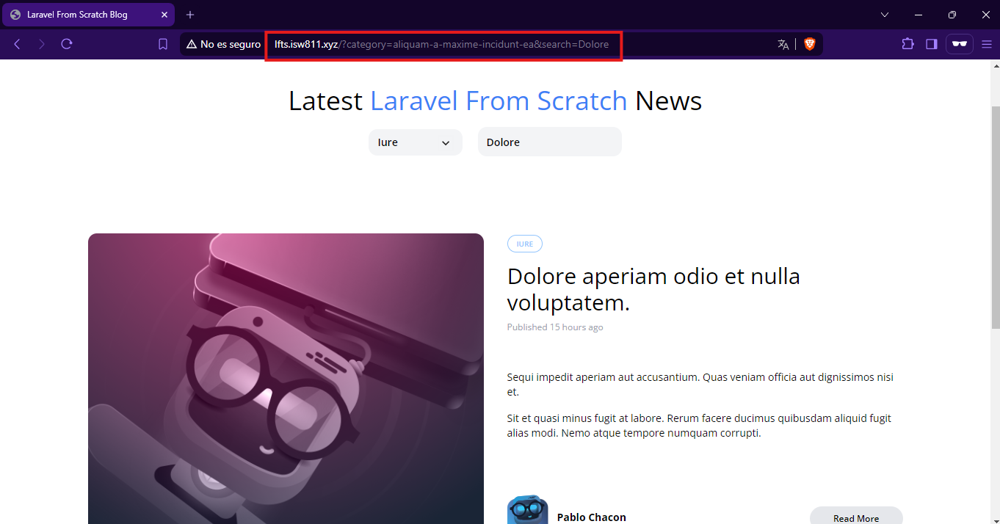

[< Volver al índice](/docs/readme.md)

# Merge Category and Search Queries

EEn este episodio, vamos a modificar tanto el menú desplegable de categorías como el campo de búsqueda para que incluyan todos los parámetros de consulta actuales y pertinentes.

Paso 1: Modificar el Formulario de Búsqueda
Primero, editamos el archivo `_header.blade.php` para que el formulario de búsqueda se pueda mantener con la categoría seleccionada.

```php

<div class="relative flex lg:inline-flex items-center bg-gray-100 rounded-xl px-3 py-2">
    <form method="GET" action="/">
        @if (request('category'))
            <input type="hidden" name="category" value="{{ request('category') }}">
        @endif

        <input type="text" 
               name="search" 
               placeholder="Find something" 
               class="bg-transparent placeholder-black font-semibold text-sm" 
               value="{{ request('search') }}">
    </form>
</div>
```

Paso 2: Modificar el Menú Desplegable de Categorías
Luego, en el archivo `category-dropdown.blade.php`, ajustamos los enlaces de los elementos del menú desplegable para que incluyan los parámetros de consulta existentes, excepto la categoría actual.

```php
<x-dropdown>
    <x-slot name="trigger">
        <button class="py-2 pl-3 pr-9 text-sm font-semibold w-full lg:w-32 text-left flex lg:inline-flex">
            {{ isset($currentCategory) ? ucwords($currentCategory->name) : 'Categories' }}
            <x-icon name="down-arrow" class="absolute pointer-events-none" style="right: 12px;" />
        </button>
    </x-slot>

    <x-dropdown-item href="/?{{ http_build_query(request()->except('category', 'page')) }}" 
                     :active="request()->routeIs('home')">All</x-dropdown-item>

    @foreach ($categories as $category)
        <x-dropdown-item href="/?category={{ $category->slug }}&{{ http_build_query(request()->except('category')) }}" 
                         :active='request()->is("categories/{$category->slug}")'>
            {{ ucwords($category->name) }}
        </x-dropdown-item>
    @endforeach
</x-dropdown>

```
- Resultado

 


# Resumen
En este episodio, hemos ajustado tanto el campo de búsqueda como el menú desplegable de categorías para mantener todos los parámetros de consulta relevantes. Esto garantiza que al cambiar de categoría o realizar una búsqueda, las selecciones previas se conserven, proporcionando una experiencia de usuario más coherente y fluida.