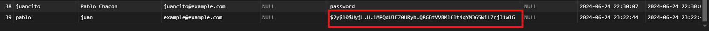

[< Volver al índice](/docs/readme.md)

# Automatic Password Hashing With Mutators

En el episodio anterior, dejamos un problema pendiente: las contraseñas se estaban guardando en texto plano en la base de datos. Esto es algo que nunca debemos permitir. Afortunadamente, la solución es sencilla. Utilizaremos los mutadores de Eloquent para asegurarnos de que las contraseñas siempre se almacenen encriptadas.

Paso 1: Modificar el Modelo de Usuario

En este episodio, solo necesitamos modificar un archivo: `User.php`. Vamos a añadir la siguiente función justo debajo del atributo `$casts` para encriptar las contraseñas antes de guardarlas en la base de datos:

```php
public function setPasswordAttribute($password)
{
    $this->attributes['password'] = bcrypt($password);
}
```
Paso 2: Verificar el Cambio

Ahora, visitamos la página web y registramos un nuevo usuario. Luego, verificamos en la base de datos para asegurarnos de que la contraseña se haya almacenado encriptada.

 

# Resumen
En este episodio, abordamos un problema crítico de seguridad: las contraseñas almacenadas en texto plano. Al utilizar un mutador de Eloquent en el modelo User, nos aseguramos de que todas las contraseñas se encripten automáticamente antes de guardarse en la base de datos. Esto mejora significativamente la seguridad de nuestra aplicación, protegiendo la información sensible de los usuarios.