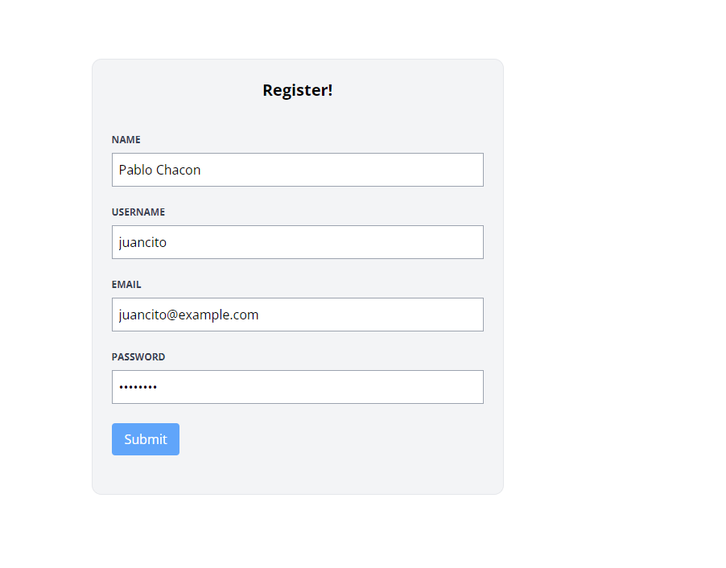
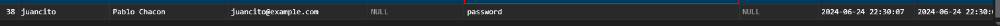

[< Volver al índice](/docs/readme.md)

# Build a Register User Page

En este episodio, comenzaremos con la gestión de formularios y la autenticación de usuarios. Vamos a crear una ruta que muestre un formulario de registro para nuevos usuarios.

Paso 1: Crear Rutas de Registro
Primero, abrimos el archivo `web.php` y añadimos lo siguiente:

```php

Route::get('register', [RegisterController::class, 'create'])->middleware('guest');
Route::post('register', [RegisterController::class, 'store'])->middleware('guest');
```

Paso 2: Crear el Controlador de Registro
En nuestra máquina virtual, ejecutamos el siguiente comando para crear el controlador RegisterController:

```bash
php artisan make:controller RegisterController
```
Luego, abrimos el archivo `RegisterController.php` y añadimos:

```php
public function create()
{
    return view('register.create');
}

public function store()
{
    $attributes = request()->validate([
        'name' => 'required|max:255',
        'username' => 'required|min:3|max:255|unique:users,username',
        'email' => 'required|email|max:255|unique:users,email',
        'password' => 'required|min:7|max:255',
    ]);

    User::create($attributes);

    return redirect('/');
}
```

Paso 3: Crear la Vista de Registro
Dentro de la carpeta views, creamos una nueva carpeta llamada `register`. Dentro de esta carpeta, creamos un archivo llamado `create.blade.php` y añadimos:

```php

<x-layout>
    <section class="px-6 py-8">
        <main class="max-w-lg mx-auto mt-10 bg-gray-100 border border-gray-200 p-6 rounded-xl">
            <h1 class="text-center font-bold text-xl">Register!</h1>

            <form method="POST" action="/register" class="mt-10">
                @csrf

                <div class="mb-6">
                    <label class="block mb-2 uppercase font-bold text-xs text-gray-700" for="name">
                        Name
                    </label>
                    <input class="border border-gray-400 p-2 w-full" type="text" name="name" id="name" required>
                </div>

                <div class="mb-6">
                    <label class="block mb-2 uppercase font-bold text-xs text-gray-700" for="username">
                        Username
                    </label>
                    <input class="border border-gray-400 p-2 w-full" type="text" name="username" id="username" required>
                </div>

                <div class="mb-6">
                    <label class="block mb-2 uppercase font-bold text-xs text-gray-700" for="email">
                        Email
                    </label>
                    <input class="border border-gray-400 p-2 w-full" type="email" name="email" id="email" required>
                </div>

                <div class="mb-6">
                    <label class="block mb-2 uppercase font-bold text-xs text-gray-700" for="password">
                        Password
                    </label>
                    <input class="border border-gray-400 p-2 w-full" type="password" name="password" id="password" required>
                </div>

                <div class="mb-6">
                    <button type="submit" class="bg-blue-400 text-white rounded py-2 px-4 hover:bg-blue-500">
                        Submit
                    </button>
                </div>
            </form>
        </main>
    </section>
</x-layout>

```
Paso 4: Configurar el Modelo de Usuario
Por último, abrimos el archivo `User.php` y eliminamos el atributo `fillable`. En su lugar, añadimos :

```php
protected $guarded = [];
```
Paso 5: Verificar el Registro
 
 

- Verificamos nuestra base de datos

 

 
# Resumen 
En este episodio, hemos configurado un formulario de registro para nuevos usuarios. Creamos las rutas necesarias, configuramos el controlador de registro, diseñamos la vista del formulario y ajustamos el modelo de usuario para permitir la creación de nuevos registros. Finalmente, verificamos el correcto funcionamiento del proceso de registro en nuestra aplicación web.


