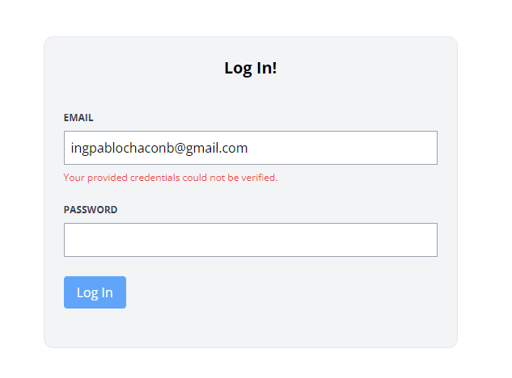

[< Volver al índice](/docs/readme.md)

# Build the Log In Page

En el episodio anterior, configuramos un enlace para el inicio de sesión, pero no completamos la vista correspondiente. En este episodio, crearemos la página de inicio de sesión para que los usuarios puedan acceder a su cuenta.

Paso 1: Definir Rutas de Inicio de Sesión
Abrimos el archivo `web.php` y añadimos las rutas necesarias para mostrar y manejar el formulario de inicio de sesión:

```php

Route::get('login', [SessionsController::class, 'create'])->middleware('guest');
Route::post('login', [SessionsController::class, 'store'])->middleware('guest');

```

Paso 2: Crear la Vista del Formulario de Inicio de Sesión
Creamos una nueva carpeta llamada `sessions` dentro de la carpeta `views`. Dentro de esta carpeta, creamos un archivo llamado `create.blade.php` con el siguiente codigo:

```php

<x-layout>
    <section class="px-6 py-8">
        <main class="max-w-lg mx-auto mt-10 bg-gray-100 border border-gray-200 p-6 rounded-xl">
            <h1 class="text-center font-bold text-xl">Log In!</h1>

            <form method="POST" action="/login" class="mt-10">
                @csrf

                <div class="mb-6">
                    <label class="block mb-2 uppercase font-bold text-xs text-gray-700"
                           for="email"
                    >
                        Email
                    </label>

                    <input class="border border-gray-400 p-2 w-full"
                           type="email"
                           name="email"
                           id="email"
                           value="{{ old('email') }}"
                           required
                    >

                    @error('email')
                        <p class="text-red-500 text-xs mt-2">{{ $message }}</p>
                    @enderror
                </div>

                <div class="mb-6">
                    <label class="block mb-2 uppercase font-bold text-xs text-gray-700"
                           for="password"
                    >
                        Password
                    </label>

                    <input class="border border-gray-400 p-2 w-full"
                           type="password"
                           name="password"
                           id="password"
                           required
                    >

                    @error('password')
                        <p class="text-red-500 text-xs mt-1">{{ $message }}</p>
                    @enderror
                </div>

                <div class="mb-6">
                    <button type="submit"
                            class="bg-blue-400 text-white rounded py-2 px-4 hover:bg-blue-500"
                    >
                        Log In
                    </button>
                </div>
            </form>
        </main>
    </section>
</x-layout>

```

Tambien se agrego el control de errores:

 


 Cuando iniciamos session con nuestro usuario nos muestra este mensaje

  


# Resumen 

En este episodio, hemos creado la página de inicio de sesión para nuestros usuarios. Añadimos las rutas necesarias en `web.php`, creamos la vista `create.blade.php` dentro de la carpeta sessions y configuramos el formulario de inicio de sesión con los campos de correo electrónico y contraseña. Al final, verificamos que la página funciona correctamente accediendo a ella desde el navegador.