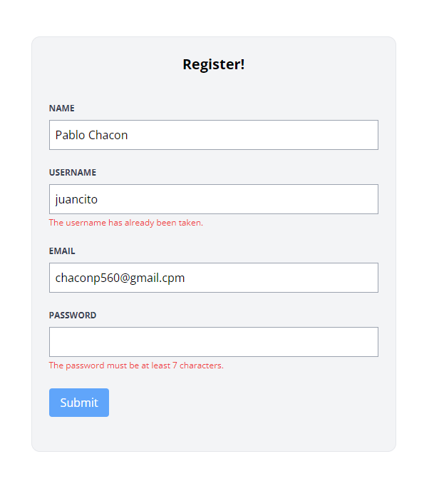

[< Volver al índice](/docs/readme.md)

# Failed Validation and Old Input Data

En este episodio, mejoraremos la experiencia del usuario proporcionando retroalimentación cuando falle la validación de los formularios. Utilizaremos la directiva `@error` de Blade para mostrar los mensajes de validación y la función old() para recuperar los datos de entrada anteriores.

Paso 1: Modificar `create.blade.php`
Primero, vamos al archivo `create.blade.php` y añadimos el atributo value en todos los campos de entrada (inputs) para que puedan mantener los datos antiguos en caso de error.

```php
<x-layout>
    <section class="px-6 py-8">
        <main class="max-w-lg mx-auto mt-10 bg-gray-100 border border-gray-200 p-6 rounded-xl">
            <h1 class="text-center font-bold text-xl">Register!</h1>
            <form method="POST" action="/register" class="mt-10">
                @csrf
                <div class="mb-6">
                    <label class="block mb-2 uppercase font-bold text-xs text-gray-700"
                           for="name"
                    >
                        Name
                    </label>
                    <input class="border border-gray-400 p-2 w-full"
                           type="text"
                           name="name"
                           id="name"
                           value="{{ old('name') }}"
                           required
                    >

                    @error('name')
                        <p class="text-red-500 text-xs mt-1">{{ $message }}</p>
                    @enderror
                </div>

                <div class="mb-6">
                    <label class="block mb-2 uppercase font-bold text-xs text-gray-700"
                           for="username"
                    >
                        Username
                    </label>
                    <input class="border border-gray-400 p-2 w-full"
                           type="text"
                           name="username"
                           id="username"
                           value="{{ old('username') }}"
                           required
                    >

                    @error('username')
                        <p class="text-red-500 text-xs mt-1">{{ $message }}</p>
                    @enderror
                </div>

                <div class="mb-6">
                    <label class="block mb-2 uppercase font-bold text-xs text-gray-700"
                           for="email"
                    >
                        Email
                    </label>
                    <input class="border border-gray-400 p-2 w-full"
                           type="email"
                           name="email"
                           id="email"
                           value="{{ old('email') }}"
                           required
                    >

                    @error('email')
                        <p class="text-red-500 text-xs mt-2">{{ $message }}</p>
                    @enderror
                </div>

                <div class="mb-6">
                    <label class="block mb-2 uppercase font-bold text-xs text-gray-700"
                           for="password"
                    >
                        Password
                    </label>
                    <input class="border border-gray-400 p-2 w-full"
                           type="password"
                           name="password"
                           id="password"
                           required
                    >

                    @error('password')
                        <p class="text-red-500 text-xs mt-1">{{ $message }}</p>
                    @enderror
                </div>

                <div class="mb-6">
                    <button type="submit"
                            class="bg-blue-400 text-white rounded py-2 px-4 hover:bg-blue-500"
                    >
                        Submit
                    </button>
                </div>
            </form>
        </main>
    </section>
</x-layout>
```


Paso 2: Añadir Mensajes de Error
Seguidamente, agregamos la directiva `@error` justo debajo de cada campo de entrada para mostrar los mensajes de error correspondientes si la validación falla.

```php

@error('name')
    <p class="text-red-500 text-xs mt-1">{{ $message }}</p>
@enderror

```
Hacemos lo mismo para cada campo de entrada.

Paso 3: Modificar `RegisterController.php`
Finalmente, actualizamos las reglas de validación en `RegisterController.php` para asegurarnos de que los atributos username y email sean únicos.

```php

'username' => 'required|min:3|max:255|unique:users,username',
'email' => 'required|email|max:255|unique:users,email'
```

Para verificar que todo funciona correctamente, intentamos registrar un usuario con datos inválidos o duplicados y observamos los mensajes de error y la persistencia de los datos de entrada antiguos.


 


# Resumen
En este episodio, mejoramos la experiencia del usuario al manejar errores de validación en formularios. Utilizamos la directiva @error para mostrar mensajes de error específicos para cada campo y la función old() para mantener los datos de entrada en caso de error. Esto asegura que los usuarios reciban una retroalimentación clara y puedan corregir fácilmente cualquier error en sus datos de entrada.