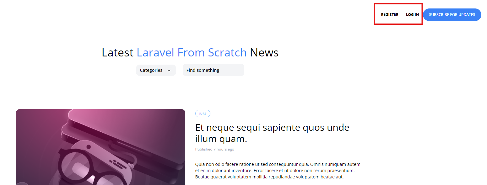

[< Volver al índice](/docs/readme.md)

# Login and Logout

En este episodio, implementaremos las funcionalidades de inicio y cierre de sesión para los usuarios. Utilizaremos las funciones auxiliares`auth()` para manejar estas acciones de manera eficiente.

Paso 1: Modificar `layout.blade.php`
Empezamos por actualizar el archivo layout.blade.php para mostrar diferentes opciones en la barra de navegación según el estado de autenticación del usuario:

```html
<div class="mt-8 md:mt-0 flex items-center">
    @auth
        <span class="text-xs font-bold uppercase">Welcome, {{ auth()->user()->name }}!</span>

        <form method="POST" action="/logout" class="text-xs font-semibold text-blue-500 ml-6">
            @csrf

            <button type="submit">Log Out</button>
        </form>
    @else
        <a href="/register" class="text-xs font-bold uppercase">Register</a>
        <a href="/login" class="ml-6 text-xs font-bold uppercase">Log In</a>
    @endauth

    <a href="#" class="bg-blue-500 ml-3 rounded-full text-xs font-semibold text-white uppercase py-3 px-5">
        Subscribe for Updates
    </a>
</div>
```

Paso 2: Modificar `RouteServiceProvider.php`
Actualizamos el atributo HOME en `RouteServiceProvider.php` para redirigir a la página principal después de iniciar sesión:

```php

public const HOME = '/';

```

Paso 3: Crear la Ruta de Logout
Añadimos la ruta para manejar el cierre de sesión en `web.php`:

```php

Route::post('logout', [SessionsController::class, 'destroy'])->middleware('auth');

```

Paso 4: Crear `SessionController.php`
Usamos Artisan para crear un nuevo controlador llamado `SessionsController`:

```bash

php artisan make:controller SessionsController

```

Paso 5: Definir Funciones en `SessionsController`
En `SessionsController.php`, agregamos las siguientes funciones para manejar la creación, el inicio y el cierre de sesión:

```php


use Illuminate\Validation\ValidationException;

class SessionsController extends Controller
{
    public function create()
    {
        return view('sessions.create');
    }

    public function store()
    {
        $attributes = request()->validate([
            'email' => 'required|email',
            'password' => 'required'
        ]);

        if (auth()->attempt($attributes)) {
            session()->regenerate();

            return redirect('/')->with('success', 'Welcome Back!');
        }

        throw ValidationException::withMessages([
            'email' => 'Your provided credentials could not be verified.'
        ]);
    }

    public function destroy()
    {
        auth()->logout();

        return redirect('/')->with('success', 'Goodbye!');
    }
}

```

Asi se debería de ver la página:

 

# Resumen
En este episodio, implementamos las funciones de inicio y cierre de sesión para los usuarios. Actualizamos `layout.blade`.php para mostrar opciones de navegación diferentes según el estado de autenticación del usuario, configuramos la redirección en `RouteServiceProvider.php`, añadimos la ruta de logout en `web.php` y creamos `SessionsController` para manejar la autenticación. Finalmente, verificamos que todo funcione correctamente en nuestra página web.