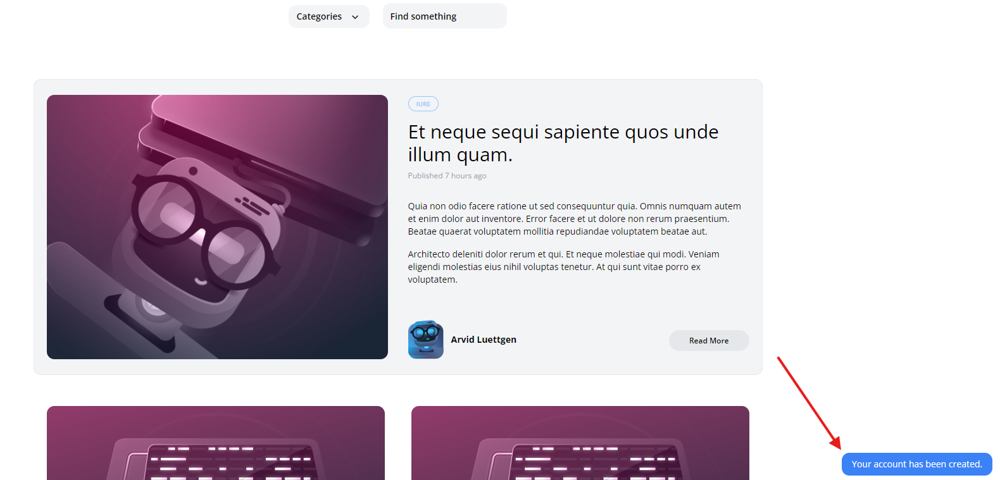

[< Volver al índice](/docs/readme.md)

# Show a Success Flash Message

Para mejorar la experiencia del usuario, vamos a mostrar un mensaje flash de éxito cuando se registre en nuestro sitio. Este mensaje será visible solo una vez y desaparecerá automáticamente después de unos segundos.

Paso 1: Modificar `layout.blade.php`
Abrimos el archivo `layout.blade.php` y añadimos el componente `x-flash` justo debajo de la sección principal en la linea 57:

```php

<x-flash />

```

Paso 2: Crear el Componente `flash.blade.php`
Creamos un nuevo archivo llamado `flash.blade.php` en la carpeta `components/views` y agregamos el siguiente código:

```php

@if (session()->has('success'))
    <div x-data="{ show: true }"
         x-init="setTimeout(() => show = false, 4000)"
         x-show="show"
         class="fixed bg-blue-500 text-white py-2 px-4 rounded-xl bottom-3 right-3 text-sm"
    >
        <p>{{ session('success') }}</p>
    </div>
@endif

```
Este código utiliza `Alpine.js` para mostrar el mensaje flash y ocultarlo automáticamente después de `4` segundos.

Paso 3: Actualizar` RegisterController.php`
Finalmente, vamos al archivo `RegisterController.php` y editamos el `return redirect` para incluir el mensaje flash en la linea 25:

```php

return redirect('/')->with('success', 'Your account has been created.');

```

Procedemos a crear un nuevo usuario en la página y verificamos que el mensaje flash de éxito se muestra correctamente y desaparece después de unos segundos.

 


# Resumen
En este episodio, hemos mejorado la retroalimentación al usuario mostrando un mensaje flash de éxito cuando se registra en nuestro sitio. Agregamos un componente en `layout.blade.php`, creamos el componente `flash.blade.php` para manejar el mensaje y actualizamos el controlador para incluir el mensaje flash. Esto asegura que los usuarios reciban una confirmación visual de que su cuenta ha sido creada exitosamente.


