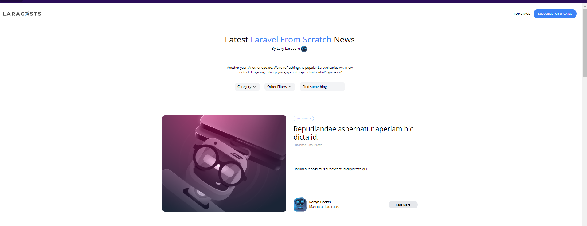

[< Volver al índice](/docs/readme.md)

# Blade Components and CSS Grids

En este episodio, continuaremos con la conversión del diseño y exploraremos las cuadrículas CSS en conjunto con componentes Blade en Laravel.

Paso 1: Modificar `post.blade.php`
Abrimos el archivo `post.blade.php` y comentamos todo excepto el componente main. Luego, añadimos el siguiente código:

```html

<main class="max-w-6xl mx-auto mt-6 lg:mt-20 space-y-6">
    <x-post-featured-card :post="$posts[0]" />
</main>
```
Paso 2: Editar `post-featured-card.blade.php`
En el archivo `post-featured-card.blade.php`, añadimos la directiva de propiedades al principio:

```php

@props(['post'])

```
Luego, editamos el componente `<div class="mt-4">` para mostrar el título y la fecha de publicación del post:

```html

<div class="mt-4">
    <h1 class="text-3xl">
         {{ $post->title }}
    </h1>

    <span class="mt-2 block text-gray-400 text-xs">
        Published <time>{{ $post->created_at->diffForHumans() }}</time>
    </span>
</div>
```
Actualizamos el contenido del archivo `post-featured-card.blade.php` para adaptarlo a nuestras rutas:

```php
@props(['post'])

<article
    class="transition-colors duration-300 hover:bg-gray-100 border border-black border-opacity-0 hover:border-opacity-5 rounded-xl">
    <div class="py-6 px-5 lg:flex">
        <div class="flex-1 lg:mr-8">
            {{-- TODO --}}
            
        </div>

        <div class="flex-1 flex flex-col justify-between">
            <header class="mt-8 lg:mt-0">
                <div class="space-x-2">
                    <a href="/categories/{{ $post->category->slug }}"
                    class="px-3 py-1 border border-blue-300 rounded-full text-blue-300 text-xs uppercase font-semibold"
                    style="font-size: 10px">{{ $post->category->name }}</a>
                </div>

                <div class="mt-4">
                    <h1 class="text-3xl">
                            <a href="/posts/{{ $post->slug }}">
                                {{ $post->title }}
                            </a>
                    </h1>

                    <span class="mt-2 block text-gray-400 text-xs">
                            Published <time>{{ $post->created_at->diffForHumans() }}</time>
                        </span>
                </div>
            </header>

            <div class="text-sm mt-2">
                <p>
                    {{ $post->excerpt }}
                </p>
            </div>

            <footer class="flex justify-between items-center mt-8">
                <div class="flex items-center text-sm">
                    
                    <div class="ml-3">
                        <h5 class="font-bold">{{ $post->author->name }}</h5>
                        <h6>Mascot at Laracasts</h6>
                    </div>
                </div>

                <div class="hidden lg:block">
                    <a href="/posts/{{ $post->slug }}"
                    class="transition-colors duration-300 text-xs font-semibold bg-gray-200 hover:bg-gray-300 rounded-full py-2 px-8"
                    >Read More</a>
                </div>
            </footer>
        </div>
    </div>
</article>

```
Paso 3: Actualizar `posts.blade.php`
Actualizamos el archivo `posts.blade.php` para mostrar los posts utilizando componentes Blade:

```html
<main class="max-w-6xl mx-auto mt-6 lg:mt-20 space-y-6">
    <x-post-featured-card :post="$posts[0]" />

    <div class="lg:grid lg:grid-cols-2 gap-4">
        @foreach ($posts->skip(1) as $post)
            <x-post-card :post="$post" />
        @endforeach
    </div>
</main>
```
Paso 4: Crear `post-card.blade.php`
Creamos el archivo `post-card.blade.php` en la carpeta components y añadimos el siguiente código:

```php
@props(['post'])

<article
    {{ $attributes->merge(['class' => 'transition-colors duration-300 hover:bg-gray-100 border border-black border-opacity-0 hover:border-opacity-5 rounded-xl']) }}>
    <div class="py-6 px-5">
        <div>
            {{-- TODO --}}
            
        </div>

        <div class="mt-8 flex flex-col justify-between">
            <header>
                <div class="space-x-2">
                    <a href="/categories/{{ $post->category->slug }}"
                        class="px-3 py-1 border border-blue-300 rounded-full text-blue-300 text-xs uppercase font-semibold"
                        style="font-size: 10px">{{ $post->category->name }}</a>
                </div>

                <div class="mt-4">
                    <h1 class="text-3xl">
                        <a href="/posts/{{ $post->slug }}">
                            {{ $post->title }}
                        </a>
                    </h1>

                    <span class="mt-2 block text-gray-400 text-xs">
                        Published <time>{{ $post->created_at->diffForHumans() }}</time>
                    </span>
                </div>
            </header>

            <div class="text-sm mt-4">
                <p>
                    {{ $post->excerpt }}
                </p>
            </div>

            <footer class="flex justify-between items-center mt-8">
                <div class="flex items-center text-sm">
                    
                    <div class="ml-3">
                        <h5 class="font-bold"> {{$post->author->name }}</h5>
                        <h6>Mascot at Laracasts</h6>
                    </div>
                </div>

                <div>
                    <a href="/posts/{{ $post->slug }}"
                        class="transition-colors duration-300 text-xs font-semibold bg-gray-200 hover:bg-gray-300 rounded-full py-2 px-8"
                    >Read More</a>
                </div>
            </footer>
        </div>
    </div>
</article>
```

Paso 5: Actualizar `posts.blade.php` con Layout
Actualizamos `posts.blade.php` para incluir el layout y el nuevo componente :

```php

<x-layout>
    @include('_post-header')

    <main class="max-w-6xl mx-auto mt-6 lg:mt-20 space-y-6">
        @if ($posts->count())
            <x-posts-grid :posts="$posts" />
        @else
            <p class="text-center">No posts yet. Please check back later.</p>
        @endif
    </main>
</x-layout>
```
Paso 6: Crear `posts-grid.blade.php`
Creamos un nuevo archivo llamado `posts-grid.blade.php` en la carpeta components:

```html

@props(['posts'])

<x-post-featured-card :post="$posts[0]" />

@if ($posts->count() > 1)
    <div class="lg:grid lg:grid-cols-6 gap-4">
        @foreach ($posts->skip(1) as $post)
            <x-post-card :post="$post" class="{{ $loop->iteration < 3 ? 'col-span-3' : 'col-span-2' }}" />
        @endforeach
    </div>
@endif

```
Imagen de la página con los cambios:

 

# Resumen
En este episodio, hemos aprendido a trabajar con componentes Blade y CSS Grids en Laravel. Hemos dividido el código en componentes reutilizables y configurado una cuadrícula CSS para mostrar nuestros posts de manera más eficiente y atractiva