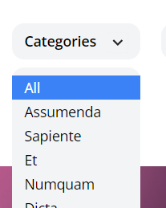

[< Volver al índice](/docs/readme.md)

# How to Extract a Dropdown Blade Component

En el episodio anterior, implementamos con éxito la funcionalidad básica de un menú desplegable. Sin embargo, aún no es reutilizable. En este episodio, vamos a crear un componente X-Dropdown Blade para lograr esto. Además, aislará todo el código específico de Alpine.js en un único archivo de componente.

Paso 1: Crear el Componente `dropdown.blade.php`

Primero, vamos a crear un nuevo archivo llamado `dropdown.blade.php` dentro de la carpeta components y le añadimos el siguiente código:

```php
@props(['trigger'])

<div x-data="{ show: false }" @click.away="show = false">
    <!-- Trigger -->
    <div @click="show = ! show">
        {{ $trigger }}
    </div>

    <!-- Links -->
    <div x-show="show" class="py-2 absolute bg-gray-100 mt-2 rounded-xl w-full z-50" style="display: none">
        {{ $slot }}
    </div>
</div>

```
Paso 2: Modificar `_posts-header.blade.php`
Luego, modificamos el archivo `_post-header.blade.php` para utilizar el nuevo componente x-dropdown:

```html

<div class="space-y-2 lg:space-y-0 lg:space-x-4 mt-8">
    <!-- Categoría -->
    <div class="relative lg:inline-flex bg-gray-100 rounded-xl">
        <x-dropdown>
            <x-slot name="trigger">
                <button class="py-2 pl-3 pr-9 text-sm font-semibold w-full lg:w-32 text-left flex lg:inline-flex">
                    {{ isset($currentCategory) ? ucwords($currentCategory->name) : 'Categories' }}
                    <x-icon name="down-arrow" class="absolute pointer-events-none" style="right: 12px;" />
                </button>
            </x-slot>

            <x-dropdown-item href="/" :active="request()->routeIs('home')">All</x-dropdown-item>

            @foreach ($categories as $category)
                <x-dropdown-item href="/categories/{{ $category->slug }}" :active="request()->is('categories/' . $category->slug)">
                    {{ ucwords($category->name) }}
                </x-dropdown-item>
            @endforeach
        </x-dropdown>
    </div>
</div>
```
Paso 3: Crear Componentes Adicionales
Ahora, creamos los archivos `dropdown-item.blade.php` y `icon.blade.php`.

- dropdown-item.blade.php
```php

@props(['active' => false])

@php
    $classes = 'block text-left px-3 text-sm leading-6 hover:bg-blue-500 focus:bg-blue-500 hover:text-white focus:text-white';
    if ($active) $classes .= ' bg-blue-500 text-white';
@endphp

<a {{ $attributes(['class' => $classes]) }}>
    {{ $slot }}
</a>
```

- icon.blade.php

```php
@props(['name'])

@if ($name == 'down-arrow')
    <svg {{ $attributes(['class' => 'transform -rotate-90']) }} width="22" height="22" viewBox="0 0 22 22">
        <g fill="none" fill-rule="evenodd">
            <path stroke="#000" stroke-opacity=".012" stroke-width=".5" d="M21 1v20.16H.84V1z"></path>
            <path fill="#222" d="M13.854 7.224l-3.847 3.856 3.847 3.856-1.184 1.184-5.04-5.04 5.04-5.04z"></path>
        </g>
    </svg>
@endif

```
Paso 4: Modificar `web.php`
Finalmente, editamos el archivo `web.php` para agregar lo siguiente a las rutas en la ruta `/` y también en la ruta categories:

```php

Route::get('/', function () {
    return view('posts', [
        'posts' => Post::latest()->get(),
        'categories' => Category::all()
    ]);
})->name('home');

```
```php

Route::get('categories/{category:slug}', function (Category $category) {
    return view('posts', [
        'posts' => $category->posts,
        'currentCategory' => $category,
        'categories' => Category::all()
    ]);
})->name('category');

```
- Resultado

 

# Resumen

En este episodio hemos extraído la funcionalidad del dropdown en un componente Blade reutilizable. Esto nos permite mantener nuestro código más limpio y modular, facilitando la reutilización y el mantenimiento del dropdown en otras partes de la aplicación. Además, hemos añadido un botón de regreso en la página para mejorar la navegación.