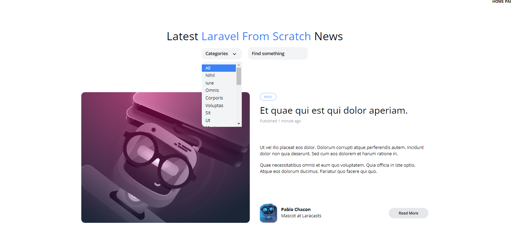

[< Volver al índice](/docs/readme.md)

# Quick Tweaks and Clean-Up

Estamos a punto de implementar la funcionalidad de búsqueda, pero antes de hacerlo, vamos a dedicar unos minutos a realizar algunos ajustes y limpieza en el código existente.

Paso 1: Modificar `dropdown.blade.php`
Primero, nos dirigimos al archivo `dropdown.blade.php` y ajustamos el div de los links para añadir estilos adicionales:

```php
<!-- Links -->
<div x-show="show" class="py-2 absolute bg-gray-100 mt-2 rounded-xl w-full z-50 overflow-auto max-h-52" style="display: none">
    {{ $slot }}
</div>
```

Este ajuste asegura que el contenido del dropdown tenga un límite de altura y pueda desplazarse si hay demasiados elementos.

Paso 2: `Limpiar _posts-header.blade.php`
En el archivo `_posts-header.blade.php`, eliminamos algunas líneas innecesarias:

```html
<h2 class="inline-flex mt-2">By Lary Laracore </h2>

<p class="text-sm mt-14">
    Another year. Another update. We're refreshing the popular Laravel series with new content.
    I'm going to keep you guys up to speed with what's going on!
</p>
```

Luego, documentamos el siguiente bloque de código:

```html
<div class="relative flex lg:inline-flex items-center bg-gray-100 rounded-xl">
    <select class="flex-1 appearance-none bg-transparent py-2 pl-3 pr-9 text-sm font-semibold">
        <option value="category" disabled selected>Other Filters</option>
        <option value="foo">Foo</option>
        <option value="bar">Bar</option>
    </select>
    <svg class="transform -rotate-90 absolute pointer-events-none" style="right: 12px;" width="22" height="22" viewBox="0 0 22 22">
        <g fill="none" fill-rule="evenodd">
            <path stroke="#000" stroke-opacity=".012" stroke-width=".5" d="M21 1v20.16H.84V1z"></path>
            <path fill="#222" d="M13.854 7.224l-3.847 3.856 3.847 3.856-1.184 1.184-5.04-5.04 5.04-5.04z"></path>
        </g>
    </svg>
</div>
```
También, cambiamos la clase` mt-8 a mt-4`:

```html
<div class="space-y-2 lg:space-y-0 lg:space-x-4 mt-4">
```

Paso 3: Modificar `PostFactory.php`
En el archivo `PostFactory.php`, ajustamos los atributos excerpt y body para mejorar el formato del texto:

```php

'excerpt' => '<p>' . implode('</p><p>', $this->faker->paragraphs(2)) . '</p>',
'body' => '<p>' . implode('</p><p>', $this->faker->paragraphs(6)) . '</p>'
```
Paso 4: Actualizar la Base de Datos
En la máquina virtual, navegamos a `/vagrant/sites/lfts.isw811.xyz/` y ejecutamos los siguientes comandos para reiniciar y volver a poblar la base de datos:

```bash
php artisan migrate:fresh
php artisan migrate:fresh --seed

o

App\Models\Post::factory(30)->create();

```
Paso 5: Ajustar `post-featured-card.blade.php` y `post-card.blade.php`


Modificamos el archivo `post-featured-card.blade.php` para incluir el excerpt con formato HTML:

```php

<div class="text-sm mt-2 space-y-4">
    {!! $post->excerpt !!}
</div>
```
Hacemos lo mismo en `post-card.blade.php`:

```php
<div class="text-sm mt-4 space-y-4">
    {!! $post->excerpt !!}
</div>
```
Paso 6: Actualizar `post.blade.php`

Finalmente, en el archivo `post.blade.php`, ajustamos el cuerpo de la publicación para que se muestre con formato HTML:

```php

<div class="space-y-4 lg:text-lg leading-loose">
    {!! $post->body !!}
</div>
```
Resultado:

 

# Resumen

En este episodio hemos realizado varios ajustes y limpieza en el código, asegurando que nuestros componentes y datos se muestren correctamente y con un buen formato. Esto nos prepara para avanzar hacia la implementación de la funcionalidad de búsqueda en los próximos episodios.