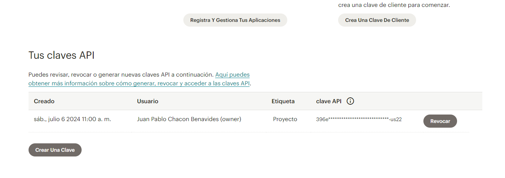

[< Volver al índice](/docs/readme.md)

# Mailchimp API Tinkering

En este episodio, nos familiarizaremos con la API de Mailchimp. Aprenderemos a instalar el SDK oficial de PHP y revisaremos los conceptos básicos para realizar algunas llamadas iniciales a la API.

# Pasos a seguir:

1. **Modificar el archivo `layout.blade.php`**:
   - Editamos el `href` del componente `<a>` de "Suscribe for updates":

     ```html
     <a href="#newsletter" class="bg-blue-500 ml-3 rounded-full text-xs font-semibold text-white uppercase py-3 px-5">
         Subscribe for Updates
     </a>
     ```

   - Añadimos un `id` al footer:

     ```html
     <footer id="newsletter" class="bg-gray-100 border border-black border-opacity-5 rounded-xl text-center py-16 px-10 mt-16">
     ```

2. **Registrar una cuenta en Mailchimp**:
   - Nos dirigimos a [`https://us21.admin.mailchimp.com/`](https://us21.admin.mailchimp.com/) y nos registramos creando una cuenta.
   - Una vez creada la cuenta, vamos al apartado de perfil, luego a "Extras" y seleccionamos "Claves API":

   - Creamos una clave API:

     

3. **Configurar las variables de entorno**:
   - Abrimos el archivo `.env` y agregamos la clave API al final del documento:

     ```bash
     MAILCHIMP_KEY=tu_clave_api
     ```

4. **Configurar el archivo `services.php`**:
   - Nos dirigimos al archivo `services.php` y añadimos la configuración de Mailchimp:

     ```php
     'mailchimp' => [
         'key' => env('MAILCHIMP_KEY'),
         'lists' => [
             'subscribers' => env('MAILCHIMP_LIST_SUBSCRIBERS')
         ]
     ]
     ```

5. **Instalar la librería del cliente de Mailchimp**:
   - Abrimos nuestra máquina virtual, nos posicionamos en `/vagrant/sites/lfts.isw811.xyz` y ejecutamos el siguiente comando para instalar la librería del cliente para PHP:

     ```bash
     composer require mailchimp/marketing
     ```

6. **Verificar la configuración de Mailchimp**:
   - Podemos usar el comando `config('services.mailchimp')` para verificar la configuración de Mailchimp.

7. **Agregar una nueva ruta en `web.php`**:
   - Nos dirigimos al archivo `web.php` y agregamos la siguiente ruta para probar la integración con Mailchimp:

     ```php
     Route::get('ping', function () {
         $mailchimp = new \MailchimpMarketing\ApiClient();

         $mailchimp->setConfig([
             'apiKey' => config('services.mailchimp.key'),
             'server' => 'us22'
         ]);

         $response = $mailchimp->lists->addListMember('tu_list_id', [
             'email_address' => 'tu_correo@example.com',
             'status' => 'subscribed'
         ]);

         print_r($response);
     });
     ```

# Verificación final:
- Nos dirigimos a la URL `tu_dominio/ping` para verificar que la configuración y la integración con Mailchimp funcionan correctamente. Deberíamos ver una respuesta en formato JSON que confirme la suscripción exitosa del correo electrónico especificado.

---

# Resumen :

En este episodio, nos familiarizamos con la API de Mailchimp instalando el SDK oficial de PHP. Realizamos varias configuraciones iniciales, como modificar el archivo `layout.blade.php`, registrar una cuenta en Mailchimp, configurar variables de entorno, y ajustar el archivo `services.php`. También instalamos la librería del cliente de Mailchimp y verificamos la configuración agregando una nueva ruta en `web.php` para probar la integración con la API.