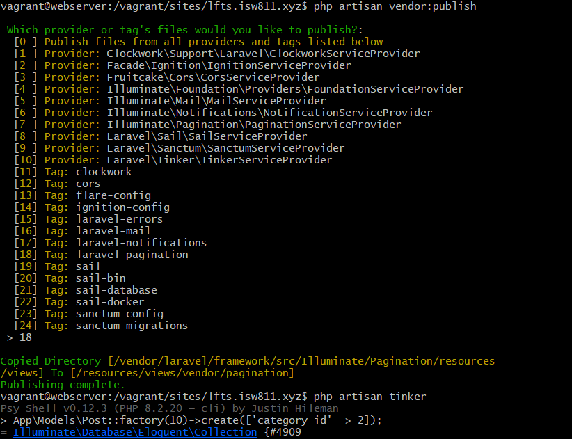

[< Volver al índice](/docs/readme.md)

# Laughably Simple Pagination

Actualmente, estamos recuperando todas las publicaciones de la base de datos y mostrándolas en la página principal en formato de cuadrícula. Sin embargo, cuando hay muchas entradas, como quinientas, esto puede ser muy costoso en términos de rendimiento. La solución es usar la paginación, y afortunadamente, Laravel facilita este proceso.

En este episodio, resolveremos ese problema.

Paso 1: Editar el Controlador
Primero, abrimos el archivo `PostsController.php` y modificamos la función `index`.

```php
return view('posts.index', [
    'posts' => Post::latest()->filter(
        request(['search', 'category', 'author'])
    )->paginate(18)->withQueryString()
]);
```

Paso 2: Actualizar la Vista
Luego, en el archivo `index.blade.php`, agregamos el siguiente código .

```php

{{ $posts->links() }}

```

Paso 3: Ajustar el Desplegable de Categorías
A continuación, en el archivo `category-dropdown.blade.php`, realizamos las siguientes modificaciones:

- Cambiamos el href del componente x-dropdown-item dentro del @foreach para incluir page en el except.
```php

href="/?category={{ $category->slug }}&{{ http_build_query(request()->except('category', 'page')) }}"
```
- Modificamos el href del x-dropdown-item fuera del @foreach.

```php

href="/?{{ http_build_query(request()->except('category', 'page')) }}"
```

Paso 4: Publicar los Archivos de Paginación
Luego, abrimos nuestra máquina virtual y nos ubicamos en `/vagrant/sites/lfts.isw811.xyz`, y ejecutamos el siguiente comando.

```bash

php artisan vendor:publish


```

y dijitamos el numero 18 o donde este publish para agregar los archivos 


- Para agregar mas post

```bash
App\Models\Post::factory(10)->create(['category_id' => 2]);
```
 


 - Resultado de la página 


# Resumen
En este episodio, hemos abordado el problema de cargar demasiadas publicaciones a la vez mediante la implementación de la paginación en Laravel. Ajustamos el controlador, las vistas y los componentes necesarios para asegurarnos de que nuestra página sea eficiente y fácil de navegar.