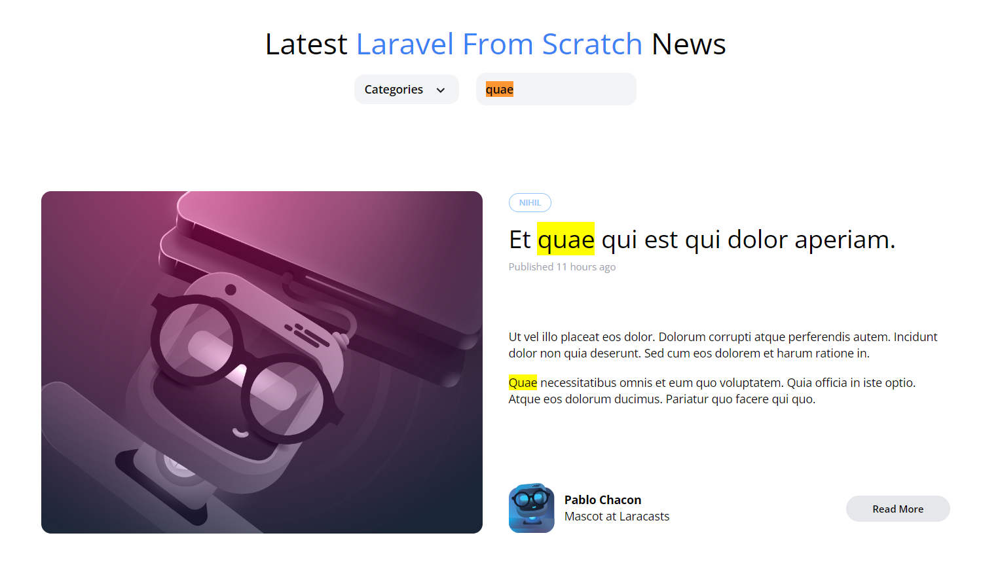

[< Volver al índice](/docs/readme.md)

# Search (The Cleaner Way)

Ahora que nuestro formulario de búsqueda está funcionando, vamos a refactorizar el código para que sea más limpio y reutilizable.

En este episodio, no solo revisaremos las clases de controlador, sino que también aprenderemos sobre los ámbitos de consulta en Eloquent.

Para empezar, abrimos nuestra máquina virtual en `/vagrant/sites/lfts.isw811.xyz` y ejecutamos el comando para crear un nuevo controlador llamado `PostController`.

- codigo para crear el controller 
```bash

php artisan make:controller PostController
```

Luego, abrimos el archivo `web.php` y recortado el código dentro de las rutas `Route::get('/')` y `Route::get('posts/{post:slug}')`.

Después, nos dirigimos al archivo `PostController.php` en `(Http/Controllers)` y creamos dos funciones: `index()`, donde pegamos el código recortado de `Route::get('/')`, y `show()`, donde se pegoó el código de `Route::get('posts/{post:slug}')`.

```php
<?php

namespace App\Http\Controllers;

use App\Models\Category;
use App\Models\Post;
use Illuminate\Http\Request;

class PostController extends Controller
{
    public function index()
    {
        $posts = Post::latest();

        if (request('search')) {
            $posts
                ->where('title', 'like', '%' . request('search') . '%')
                ->orWhere('body', 'like', '%' . request('search') . '%');
        }
        
        return view('posts', [
            'posts' => $posts->get(),
            'categories' => Category::all()
        ]);
    }

    public function show(Post $post)
    {
        return view('post', [
            'post' => $post
        ]);
    }
}

```
Luego, volvemos al archivo `web.php` y actualizamos las rutas `Route::get('/')` y `Route::get('posts/{post:slug}')` para que usen nuestro nuevo controlador.

```php

Route::get('/', [PostController::class, 'index'])->name('home');
Route::get('posts/{post:slug}', [PostController::class, 'show']);

```
Ahora, editamos el archivo `Post.php` en `(App/Models)`y agregamos un ámbito de consulta para filtrar los resultados de búsqueda.

```php

public function scopeFilter($query, array $filters)
{
    $query->when($filters['search'] ?? false, fn ($query, $search) =>
        $query
            ->where('title', 'like', '%' . $search . '%')
            ->orWhere('body', 'like', '%' . $search . '%')
    );
}
```
Finalmente, volvemos al archivo `PostController.php` y modificamos la función index() para utilizar el nuevo ámbito de consulta.

```php

public function index()
{
    return view('posts', [
        'posts' => Post::latest()->filter(request(['search']))->get(),
        'categories' => Category::all()
    ]);
}
```

 

# Resumen
En este episodio, hemos refactorizado nuestro código de búsqueda, moviendo la lógica a un controlador y utilizando ámbitos de consulta en Eloquent. Esto hace que nuestro código sea más limpio y reutilizable.


