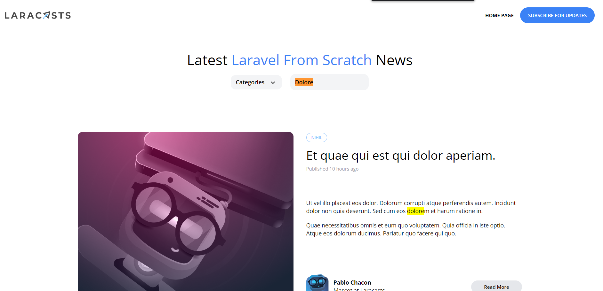

[< Volver al índice](/docs/readme.md)

# Search (The Messy Way)

implementaremos la funcionalidad de búsqueda en nuestro blog. Lo haremos en dos pasos: primero, en este episodio, simplemente lo haremos funcionar, aunque el código no será reutilizable ni elegante. Luego, en el siguiente episodio, refactorizaremos el código.

Primero, editamos el archivo `web.php` para agregar y modificar la ruta `/`, permitiendo así realizar búsquedas en la página.

```php

Route::get('/', function () {

    $posts = Post::latest();

    if (request('search')) {
        $posts
            ->where('title', 'like', '%' . request('search') . '%')
            ->orWhere('body', 'like', '%' . request('search') . '%');
    }
    
    return view('posts', [
        'posts' => $posts->get(),
        'categories' => Category::all()
    ]);
})->name('home');

```

Luego, nos dirigimos al archivo `_posts-header.blade.php` y modificamos el input de search para que nos muestre el valor buscado en la barra de búsqueda.

```html

<input type="text" name="search" placeholder="Find something" 
class="bg-transparent placeholder-black font-semibold text-sm"
value="{{ request('search') }}">
```
Finalmente, verificamos la página web para asegurar que los cambios se han aplicado correctamente.

 

# Resumen

En este episodio, hemos implementado la funcionalidad de búsqueda básica en nuestro blog. Ahora, los usuarios pueden buscar publicaciones por título o contenido, y la barra de búsqueda retendrá el término buscado.