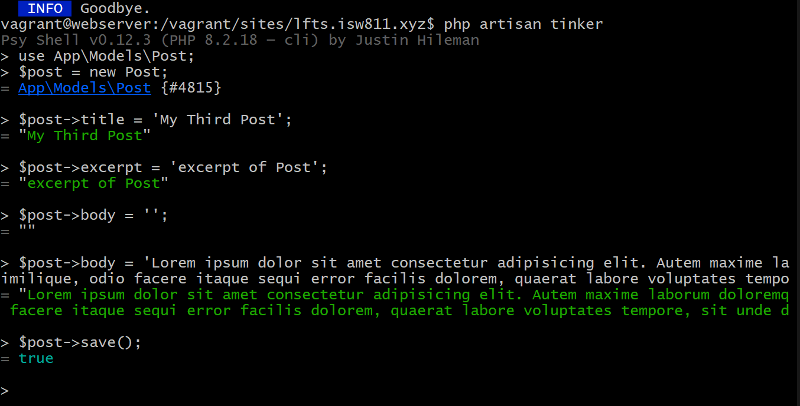
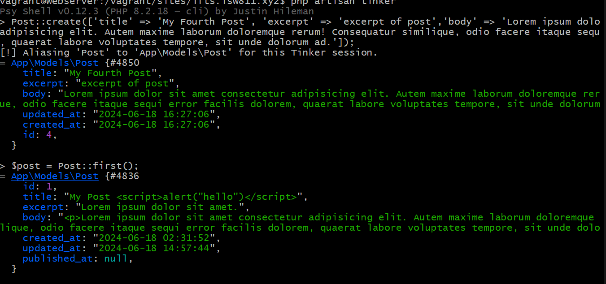
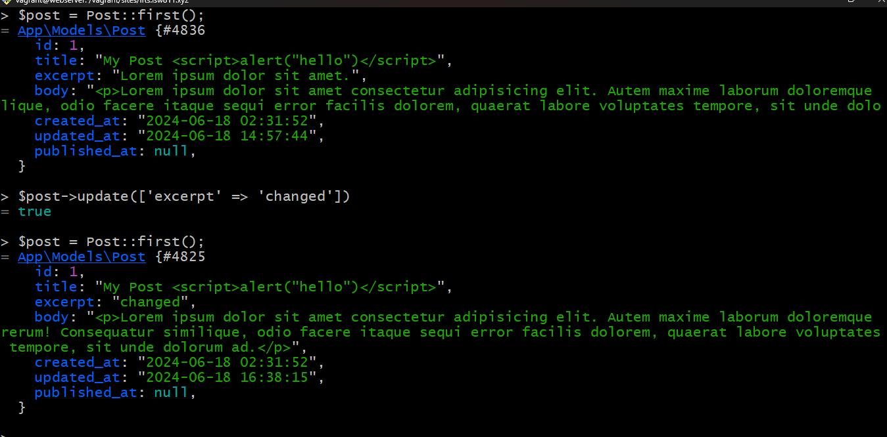

[< Volver al índice](/docs/readme.md)

# 3 Ways to Mitigate Mass Assignment Vulnerabilities

En este episodio vamos a seguir aprendiendo que mas podemos hacer con los posts y todo lo que necesitamos saber sobre las vulnerabilidades sobre asignación masiva y tambien como podemos porteger datos

empezamo entrando a tinker para crear un nuevo post como en los capitulos pasados

Seguimos los pasos de la imagen 


 

Nos vamos a nuestro proyecto y hacemos un cambio en nuesto Post.php en App/Models. Agregamos

```php
class Post extends Model
{
    use HasFactory;

    protected $fillable = ['title', 'excerpt', 'body', 'id'];
}
```

Esto para poder crear un post de una manera mas dinamica en una sola linea de comando.Vamos a nuestra terminal de bash para crear un post donde usaremos el comando 

`Post::create(['title' => 'My Fourth Post', 'excerpt' => 'excerpt of post','body' => 'Lo adipisicing elit. Autem maxime laborum doloremque rerum! Consequatur similique, odio face, quaerat labore voluptates tempore, sit unde dolorum ad.']);`

 


 Por ultimo modificamos nuestro posts.blade de views en la linea 6 agregaremos para mostrar en la pagina los titulos correctamente.
 `{!! $post->title !!}`


# Datos importantes

- si queremos proteger un dato para que no se pueda editar deemos modificar nuestro archivo post.php

```php
class Post extends Model
{
    use HasFactory;

    protected $guarded = []; //podemos poner el dato para protegerlo por ejemplo  protected $guarded = ['id'];
    
}
```

- Si queremos hacer un update pomos hacerlo el siguiente comando ` $post->update(['excerpt' => 'changed'])`


 

