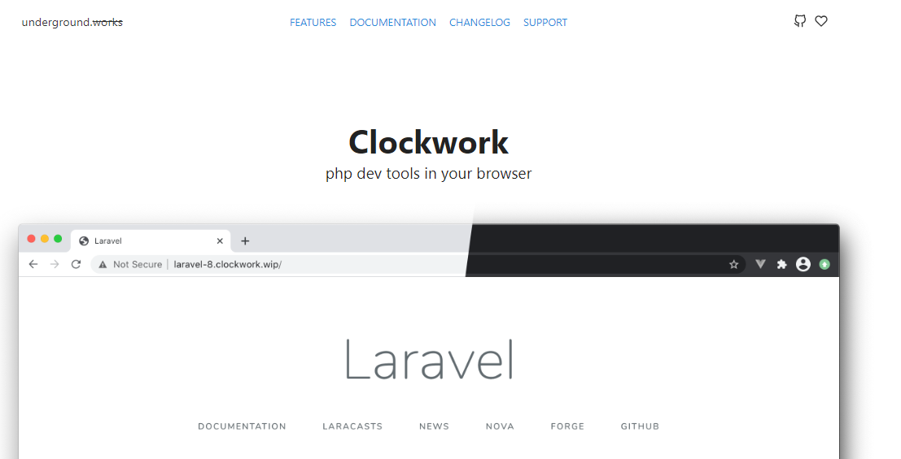
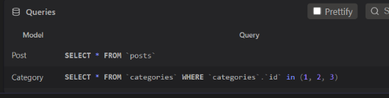

[< Volver al índice](/docs/readme.md)

# Clockwork, and the N+1 Problem


En este episodio, abordamos un problema de rendimiento que mencionamos brevemente en el episodio anterior, conocido como el problema N+1. Este problema surge debido a que Laravel carga las relaciones de manera perezosa, lo que puede resultar en la ejecución de una consulta SQL adicional por cada elemento dentro de un bucle. Así, cincuenta elementos pueden generar cincuenta consultas SQL.

En este episodio, depuraremos estas consultas manualmente y utilizando la excelente extensión de Clockwork, y luego resolveremos el problema cargando ansiosamente cualquier relación que referenciamos.

Para empezar, abriremos nuestra máquina virtual en `/vagrant/sites/lfts.isw811.xyz` y ejecutaremos el siguiente comando:

`composer require itsgoingd/clockwork`

Luego, abriremos nuestro navegador e instalaremos la extensión llamada Clockwork:

 

Después, podremos visualizarla haciendo clic derecho dentro de la página, seleccionando inspeccionar y luego buscando la opción de Clockwork.

Para solucionar el problema de rendimiento, modificaremos el archivo web.php de la siguiente manera, para que busque todas las categorías mediante los IDs existentes:

 
 
```php
Route::get('/', function () {

    return view('posts', [
        'posts' => Post::with('category')->get()
    ]);
});

```


# Resumen
En este episodio, exploramos el problema N+1 en Laravel, que ocurre debido a la carga perezosa de relaciones y puede causar múltiples consultas SQL innecesarias. Utilizamos la extensión Clockwork para depurar y resolver este problema, cambiando a una carga ansiosa de relaciones en nuestro archivo web.php, mejorando así el rendimiento de nuestra aplicación.