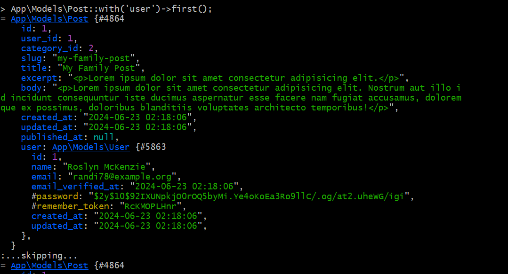
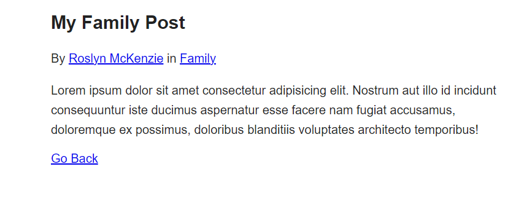

[< Volver al índice](/docs/readme.md)

# Database Seeding Saves Time

En este episodio, relacionaremos una publicación de blog con un autor o usuario específico. Durante este proceso, nos enfrentaremos nuevamente con la necesidad de repoblar manualmente nuestra base de datos.

Sin embargo, este es un buen momento para revisar la base de datos.

Para comenzar, editaremos el archivo create_posts_table.php y agregaremos un nuevo atributo llamado user_id.

```php
$table->foreignId('user_id');
```
Luego, en nuestra máquina virtual, nos ubicaremos en /vagrant/sites/lfts.isw811.xyz y ejecutaremos el siguiente comando 

`php artisan migrate:fresh`

Luego,configuraremos para que al ejecutar el comando anterior, no tengamos que crear manualmente todos los datos de las tablas nuevamente.

Primero, editaremos el archivo DatabaseSeeder.php ubicado en la carpeta seeders y añadiremos el siguiente código para crear los datos de nuestras tablas automáticamente:

```php

    public function run()
    {
        User::truncate();
        Post::truncate();
        Category::truncate();

        $user = User::factory()->create();

        $personal = Category::create([
            'name' => 'Personal',
            'slug' => 'personal'
        ]);

        $family = Category::create([
            'name' => 'Family',
            'slug' => 'family'
        ]);

        $work = Category::create([
            'name' => 'Work',
            'slug' => 'work'
        ]);

        Post::create([
            'user_id' => $user->id,
            'category_id' => $family->id,
            'title' => 'My Family Post',
            'slug' => 'my-family-post',
            'excerpt' => '<p>Lorem ipsum dolor sit amet consectetur adipisicing elit.</p>',
            'body' => '<p>Lorem ipsum dolor sit amet consectetur adipisicing elit. Nostrum aut illo id incidunt consequuntur iste ducimus aspernatur esse facere nam fugiat accusamus, doloremque ex possimus, doloribus blanditiis voluptates architecto temporibus!</p>'
        ]);

        Post::create([
            'user_id' => $user->id,
            'category_id' => $work->id,
            'title' => 'My Work Post',
            'slug' => 'my-work-post',
            'excerpt' => '<p>Lorem ipsum dolor sit amet consectetur adipisicing elit.</p>',
            'body' => '<p>Lorem ipsum dolor sit amet consectetur adipisicing elit. Nostrum aut illo id incidunt consequuntur iste ducimus aspernatur esse facere nam fugiat accusamus, doloremque ex possimus, doloribus blanditiis voluptates architecto temporibus!</p>'
        ]);
    }

```

Luego, editaremos el archivo create_categories_table.php para que los atributos name y slug sean únicos:

```php
$table->string('name')->unique();
$table->string('slug')->unique();
```
Después de estos cambios, en nuestra máquina virtual, ejecutaremos el siguiente comando para borrar, refrescar y crear las tablas con datos automáticamente:


`php artisan migrate:fresh --seed`

A continuación, en el archivo Post.php, crearemos una nueva relación con Eloquent para el User:

```php
public function user()
{
    return $this->belongsTo(User::class);
}

```
De manera similar, en el archivo User.php, agregaremos la siguiente función:

```php

public function posts()
{
    return $this->hasMany(Post::class);
}
```


Regresamos a nuestra máquina virtual y ejecutamos el siguiente comando para hacer búsquedas:

`php artisan tinker`

Y luego ejecutamos los siguientes comandos para ver los post relacionados al usuario:

 

Finalmente, en el archivo post.blade.php, agregaremos el siguiente código para mostrar el usuario de la publicación:

```php
<p>
    By <a href="#">{{ $post->user->name }}</a> in <a href="/categories/{{$post->category->slug}}">{{ $post->category->name }}</a>
</p>

```
Así deberia de nuestra página

 

# Resumen
En este episodio, aprendimos a asociar publicaciones de blog con usuarios específicos y exploramos cómo la siembra de base de datos puede ahorrarnos tiempo al evitar la repoblación manual de datos. Implementamos la siembra de base de datos y configuramos las relaciones Eloquent entre usuarios y publicaciones, mejorando la eficiencia de nuestro flujo de trabajo.