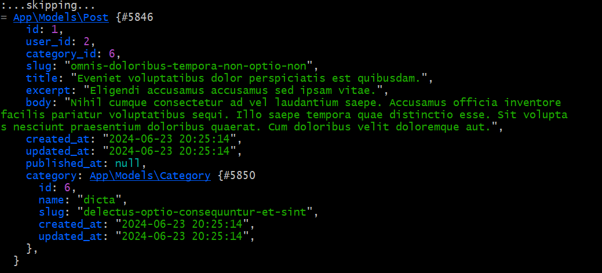

[< Volver al índice](/docs/readme.md)

# Eager Load Relationships on an Existing Model

En este episodio, aprenderemos a especificar qué relaciones deben cargarse de forma predeterminada en un modelo, optimizando así nuestras consultas y mejorando el rendimiento de la aplicación.

Para empezar, abrimos el navegador de comandos y creamos posts con el siguiente comando:

```bash
php artisan tinker
```
Dentro del bash, ejecutamos el siguiente comando para crear 10 posts asociados a la categoría con el ID número 1:

```bash

App\Models\Post::factory(10)->create(['category_id' => 1]);

```

Luego, nos dirigimos al archivo `web.php` y modificamos las rutas para renderizar mejor la página, asegurándonos de cargar las relaciones necesarias. Añadimos la siguiente línea de código en las rutas tanto para slug como para username:

```php

'posts' => $category->posts->load(['category', 'author'])
```
Para hacer el código más limpio y evitar repetición, vamos al archivo Post.php y agregamos la siguiente línea de código que se encarga de cargar automáticamente las relaciones category y author:

```php

protected $with = ['category', 'author'];
```


 
 
# Resumen
En este episodio, optimizamos la carga de relaciones en un modelo especificando qué relaciones deben cargarse por defecto. Creamos posts utilizando tinker, ajustamos las rutas en `web.php` para cargar las relaciones necesarias y finalmente, simplificamos el código añadiendo la propiedad $with en el modelo Post. Esto nos permitió mejorar el rendimiento y la legibilidad de nuestra aplicación.