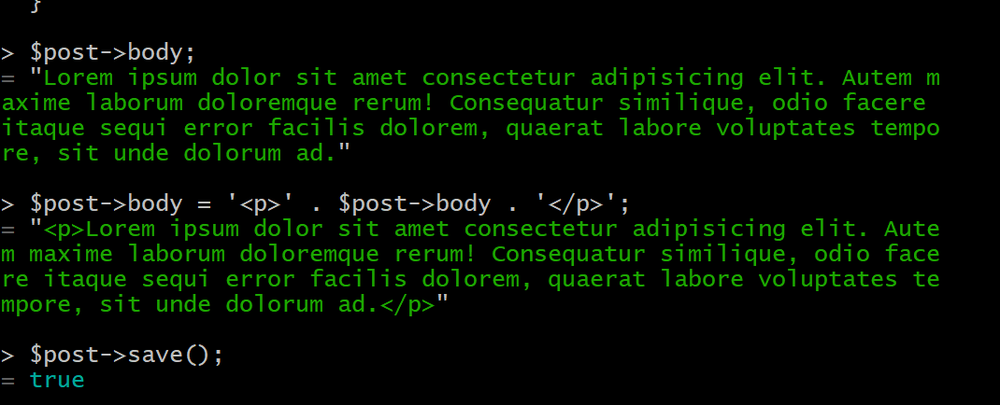
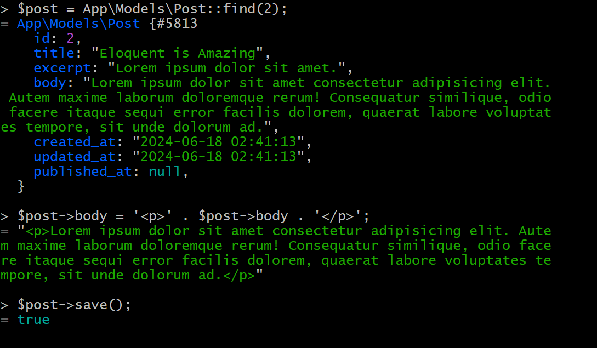
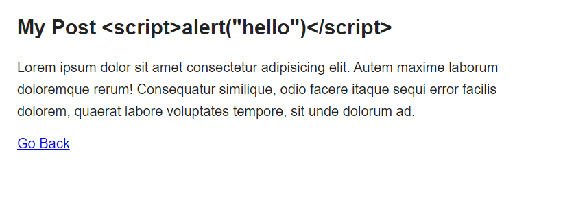
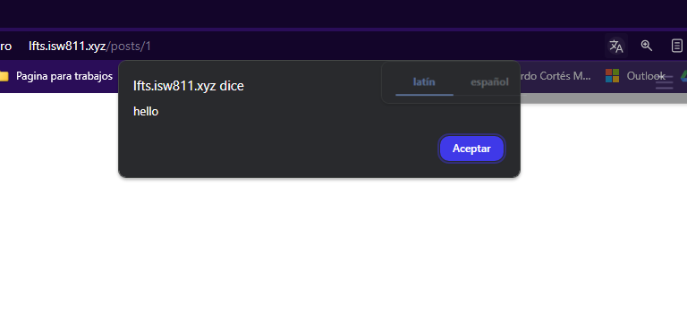

[< Volver al índice](/docs/readme.md)

# Eloquent Updates and HTML Escaping

En este episodio vamos a aprender a actualzar los post,empezamos entrando a nuestra base de datos una vez dentro, entraremos entramos a tinker `php artisan tinker`

ejecumos $post = `App\Models\Post::first();` para que nos muestre el primer post

Para ver le body `$post->body;`

Ejecutaremos `$post->body = '
' . $post->body . '
';` para asegurarnos que el contenido se muestre en un párrafo y guardamos los cambios `$post->save();`. 

 

Hacemos los mismos cambios para el segundo post.

 

Modificaremos nuevamente el post y le pondremos una alerta ` $post->title = 'My Post ';` 

Para ver los cambios reflejas en la página y que no se vea de esta manera 

 

Debemos hacer un cambio en post.blade que se encuntra en resources/views. Cambiaremos el h1 por esto
` <h1>{!! $post->title !!}</h1>` 

 

 En este episodio, se demostró cómo actualizar y formatear el contenido de los posts utilizando Eloquent y cómo manejar el contenido HTML de manera segura para evitar problemas de seguridad, como la ejecución de scripts no deseados. Envolviendo el contenido en etiquetas HTML apropiadas y utilizando funciones de escapado en las vistas, se puede garantizar que el contenido se muestre correctamente y de forma segura en la aplicación web.