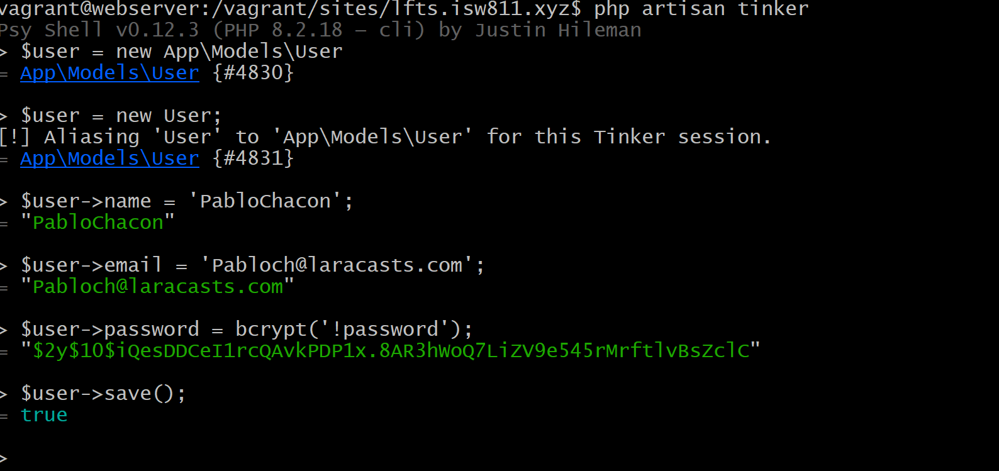
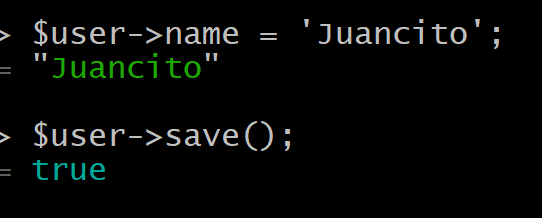
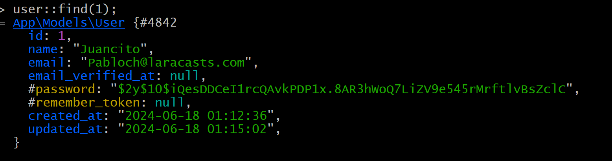
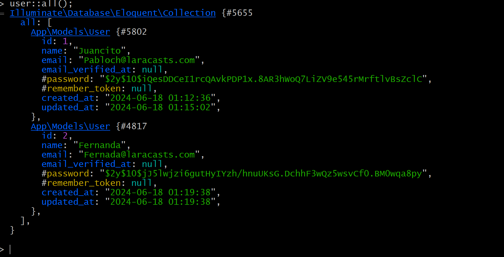

[< Volver al índice](/docs/readme.md)

# Eloquent and the Active Record Pattern

En este episodio vamos a comenzar a crear usuarios en las tablas mediante la consola

antes de empezar es importante modificar el `2014_10_12_000000_create_users_table.php` cambiaremos el string de `username`
por `name`


```php
 public function up()
    {
        Schema::create('users', function (Blueprint $table) {
            $table->id();
            $table->string('name');
            $table->string('email')->unique();
            $table->timestamp('email_verified_at')->nullable();
            $table->string('password');
            $table->rememberToken();
            $table->timestamps();
        });
    }

```
Ahora empezaremos iniciando el bash donde tengamos la base de datos,una vez dentro ejecutamos `php artisan migrate:fresh`
luego ejecutamos `php artisan tinker`

Podemos usar los comandos para crear 

`Para crear un usuario en esta ruta`

> $user = new App\Models\User
= App\Models\User {#4830}

`Para crear un nuevo usuario`

> $user = new User;
[!] Aliasing 'User' to 'App\Models\User' for this Tinker session.
= App\Models\User {#4831}

`comando para crear el nombre`

> $user->name = 'PabloChacon';
= "PabloChacon"

`comando para crear el correo`

> $user->email = 'Pabloch@laracasts.com';
= "Pabloch@laracasts.com"

`comando para crear el password`

> $user->password = bcrypt('!password');
= "$2y$10$iQesDDCeI1rcQAvkPDP1x.8AR3hWoQ7LiZV9e545rMrftlvBsZclC"

`comando para guardar el usuario`

> $user->save();
= true

`comando para que ver el usuario creado`

> $user
= App\Models\User {#4831
    name: "PabloChacon",
    email: "Pabloch@laracasts.com",
    #password: "$2y$10$iQesDDCeI1rcQAvkPDP1x.8AR3hWoQ7LiZV9e545rMrftlvBsZclC",
    updated_at: "2024-06-18 01:12:36",
    created_at: "2024-06-18 01:12:36",
    id: 1,
  }


 

Para remplazar el nombre y guardar el cambio
  >$user->name = 'Juancito';
   = "Juancito"

> $user->save();
= true




Para ver un usuario segun su pocisión



Para ver todos los usuarios

