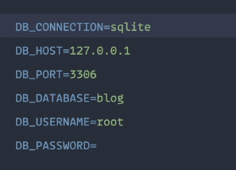
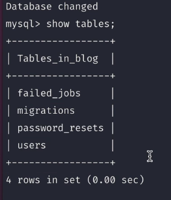

[< Volver al índice](/docs/readme.md)

# Environment Files and Database Connections

En este episodio es un poco explicativo de como vamos a usar la base de datos se explica un poco donde está la conexion,
como ver las tablas de las bases de datos y el puerto en que estamos

