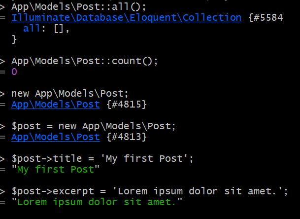
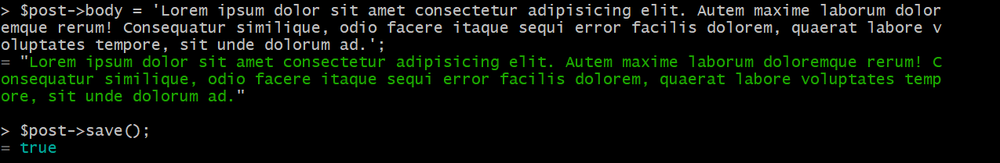

[< Volver al índice](/docs/readme.md)

# Make a Post Model and Migration

En este episodio vamos a crear un post algo similar a como creamos un usuario empezaremos entrando a nuestra base de datos 
una vez en nuestra ruta ejecutaremos `php artisan make:migration create_posts_table` para crear un archivo luego pondremos
`php artisan migrate`,luego crearemos un model con `php artisan make:model Post`.

Antes de seguir ejecutando comandos vamos a editar el archivo creado, agregaremos una estructura para el post

```php
 public function up()
    {
        Schema::create('posts', function (Blueprint $table) {
            $table->id();
            $table->string('title');
            $table->text('excerpt');
            $table->text('body');
            $table->timestamps();
            $table->timestamp('published_at')->nullable();
        });
    }
```

Entraremos a  `php artisan tinker` para crear el post


En este episodio vamos limiar nuestra base de datos, entramos donde tenemos nuestra base de datos y 
ejecutamos `php artisan migrate` despues `php artisan migrate:rollback` y por ultimo `php artisan migrate:fresh`

Nos vamos a app/database/migrations y editaremos nuestro `2014_10_12_000000_create_users_table.php`

seguiremos la guia de la imagen para crear un post


 

 Importante siempre guardar lo creado

 

Ahora modificaremos el archivo post.php que se encuentra en app/models.Agregamos una class post

```php
<?php

namespace App\Models;

use Illuminate\Database\Eloquent\Factories\HasFactory;
use Illuminate\Database\Eloquent\Model;

class Post extends Model
{
    use HasFactory;
}
```

Tambíen modificaremos el archivo posts que se encuentra en resource/views.Se agrego `{{ $post->id }}` para buscar el post
por el id

```php
<x-layout>
    @foreach ($posts as $post)
        <article>
            <h1>
                <a href="posts/{{ $post->id }}">
                    {{ $post->title }}
                </a>
            </h1>

            <div>
                {{ $post->excerpt }}
            </div>
        </article>
    @endforeach
</x-layout>
```
Por último modificaremos nuestro web.php de routes para agregar que nos muestre todos los post que existan segun el id

```php
Route::get('/', function () {
    return view('posts', [
        'posts' => Post::all()
    ]);
});

Route::get('posts/{post}', function ($id) {
    return view ('post', [
        'post' => Post::findOrFail($id)
    ]);
});
```

