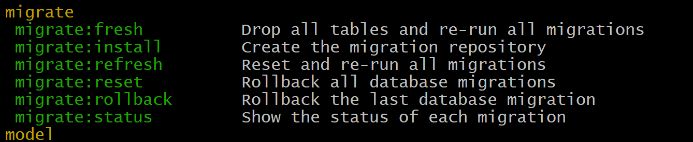

[< Volver al índice](/docs/readme.md)

# Migrations: The Absolute Basics

En este episodio vamos limiar nuestra base de datos, entramos donde tenemos nuestra base de datos y 
ejecutamos `php artisan migrate` despues `php artisan migrate:rollback` y por ultimo `php artisan migrate:fresh`

Nos vamos a app/database/migrations y editaremos nuestro `2014_10_12_000000_create_users_table.php`

```php
class CreateUsersTable extends Migration
{
    /**
     * Run the migrations.
     *
     * @return void
     */
    public function up()
    {
        Schema::create('users', function (Blueprint $table) {
            $table->id();
            $table->string('username');
            $table->string('email')->unique();
            $table->string('password');
            $table->boolean('is_admin')->default(false);
            $table->rememberToken();
            $table->timestamps();
        });
    }

    /**
     * Reverse the migrations.
     *
     * @return void
     */
    public function down()
    {
        Schema::dropIfExists('users');
    }
}
```

luego de hacer los cambios en `2014_10_12_000000_create_users_table.php` ejecutaremos nuevamente los comandos
 `php artisan migrate` despues `php artisan migrate:rollback` y por ultimo `php artisan migrate:fresh`

 

 

