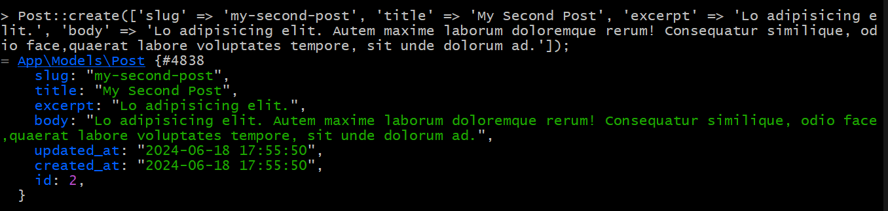

[< Volver al índice](/docs/readme.md)

# Route Model Binding

En este episodio vamos a implementar el enlace del modelo de ruta para que nos salga en en link del buscardo,comencemos editando nuestro archivo create_post_table debemos agregar en la linea 18 despues del id  `$table->string('slug')->unique();`, Pasaremos a nuestra terminal de bash donde entraremos a webserver o donde se encuntra nuestra base de datos para ejecutar `php artisan migrate:fresh` de esta manera eliminaremos los post.

Despues de eliminar los post crearemos nuevos pero con el campo de slug como el ejemplo de la imagen

 


Una vez creado los post editaremos nuestro web.php. Agregaremos slug para que nos muestre el nombre en el la ruta o link de la página.

```php
Route::get('/', function () {
    return view('posts', [
        'posts' => Post::all()
    ]);
});

Route::get('posts/{post:slug}', function (Post $post) {
    return view ('post', [
        'post' => $post
    ]);
});
Auth::routes();
```

Tambien agregaresmos slug en nuestro archivo de views post.blade en la linea 5.

```php

<x-layout>
    @foreach ($posts as $post)
        <article>
            <h1>
                <a href="posts/{{ $post->slug }}">
                    {!! $post->title !!}
                </a>
            </h1>

            <div>
                {{ $post->excerpt }}
            </div>
        </article>
    @endforeach
</x-layout>
```

# Resumen

En este episodio se mostró cómo implementar el enlace de modelo de ruta en Laravel para mejorar la semántica y la amigabilidad de las URLs mediante el uso de slugs. Este enfoque facilita la creación de enlaces más intuitivos y legibles, mejorando la experiencia del usuario y el programador de la aplicación web.