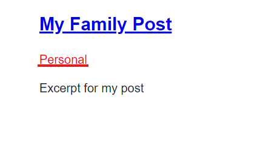

[< Volver al índice](/docs/readme.md)

# Show All Posts Associated With a Category

En este episodio vamos a asociar los post a las categorias para ello en vamos hacer las siguientes modificaciones.

- En nuestro archivo category.php (App/Models) implementaremos

```php

class Category extends Model
{
    use HasFactory;

    public function posts()
    {
        return $this->hasMany(Post::class);
    }
}

```

- En nuestros archivos post y posts (resources/views) Remplazaremos nuestras etiquetas a href

`post`

```php
<article>
        <h1>{{ $post->title }}</h1>

        <p>
            <a href="/categories/{{ $post->category->slug }}">{{ $post->category->name }}</a>
        </p>

        <div>
            {!! $post->body !!}
        </div>
    </article>
```
`posts`

```php
<article>
            <h1>
                <a href="posts/{{ $post->slug }}">
                    {!! $post->title !!}
                </a>
            </h1>

            <p>
                <a href="categories/{{ $post->category->slug }}">{{ $post->category->name }}</a>
            </p>

            <div>
                {{ $post->excerpt }}
            </div>
        </article>
```


- En nuestro archivo web.php (resources/routes) agregaremos una ruta para category

```php
Route::get('categories/{category:slug}', function (Category $category)
{
    return view ('posts', [
        'posts' => $category->posts
    ]);
});
```
De esta manera podemos ver los post que asociamos a las categorias en el episodio anterior.

 


# Resumen

En este episodio, se aprendió a implementar y visualizar la relación entre posts y categorías en Laravel.
