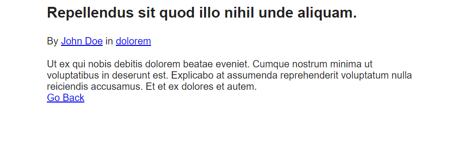

[< Volver al índice](/docs/readme.md)

# Turbo Boost With Factories

En este episodio, vamos a explorar cómo integrar las fábricas de modelos para generar fácilmente cualquier cantidad de registros en la base de datos, optimizando así el proceso de siembra de datos.

Para empezar, utilizaremos el siguiente comando para crear usuarios. Dentro del método factory(), especificamos la cantidad de usuarios a crear:

`App\Models\User::factory()->create();`

En nuestra máquina virtual, ejecutamos el siguiente comando para crear un archivo PostFactory, el cual nos permitirá generar cuantos posts queramos en la base de datos:

`php artisan make:factory PostFactory`

Después de crear el archivo, lo editamos y agregamos la siguiente función para definir cómo se crearán los posts:

```php

class PostFactory extends Factory
{
    /**
     * Define the model's default state.
     *
     * @return array
     */
    public function definition()
    {
        return [
            'user_id' => User::factory(),
            'category_id' => Category::factory(),
            'title' => $this->faker->sentence,
            'slug' => $this->faker->slug,
            'excerpt' => $this->faker->sentence,
            'body' => $this->faker->paragraph
        ];
    }
}

```
Luego, volvemos a la máquina virtual y ejecutamos el siguiente comando para borrar y recrear las tablas:

`php artisan migrate:fresh`

A continuación, ejecutamos el comando para crear un archivo CategoryFactory, que nos permitirá generar las categorías necesarias:

`php artisan make:factory CategoryFactory`

En el archivo creado, añadimos el siguiente código:

```php


class CategoryFactory extends Factory
{
    /**
     * Define the model's default state.
     *
     * @return array
     */
    public function definition()
    {
        return [
            'name' => $this->faker->word,
            'slug' => $this->faker->slug
        ];
    }
}
```

Después de esto, volvemos a la máquina virtual y accedemos al navegador con el siguiente comando:

`php artisan tinker`

Dentro del navegador, ejecutamos el siguiente comando para crear los posts:

`App\Models.Post::factory()->create();`

Para probar, editamos el archivo DatabaseSeeder.php y modificamos la función run() para crear un solo usuario con 5 posts:

```php
public function run()
{
    $user = User::factory()->create([
        'name' => 'Pablo Chacon'
    ]);

    Post::factory(5)->create([
        'user_id' => $user->id
    ]);
}

```

Finalmente, volvemos a la máquina virtual y ejecutamos el siguiente comando para borrar, refrescar y poblar las tablas de la base de datos:

`php artisan migrate:fresh --seed`


 

# Resumen
En este episodio, aprendimos a utilizar fábricas de modelos para generar registros en la base de datos de manera eficiente. Implementamos fábricas para usuarios, categorías y posts, y ajustamos la función run() en DatabaseSeeder.php para crear múltiples posts para un solo usuario. Esto nos permitió poblar rápidamente la base de datos y verificar los resultados en la aplicación.