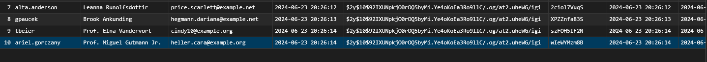
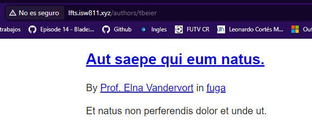

[< Volver al índice](/docs/readme.md)

# View All Posts By An Author

En este episodio, aprenderemos a crear una nueva ruta que muestre todas las entradas de blog escritas por un autor específico.

Para comenzar, modificamos el archivo `web.php` y utilizamos la función `latest()` para ordenar los posts de forma descendente:

```php

Route::get('/', function () {
    return view('posts', [
        'posts' => Post::latest()->with('category')->get()
    ]);
});
```
Luego, nos dirigimos al archivo `post.blade.php` y agregamos la siguiente línea de código para mostrar el autor y la categoría de cada post:

```html
<p>
    By <a href="#">{{ $post->author->name }}</a> in <a href="/categories/{{ $post->category->slug }}">{{ $post->category->name }}</a>
</p>
```
Realizamos el mismo cambio en el archivo `posts.blade.php`

Ahora, editamos el archivo `post.php` para renombrar la función user a author y actualizar :

```php

public function author()
{
    return $this->belongsTo(User::class, 'user_id');
}

```
Luego, volvemos al archivo `web.php` para modificar la ruta principal y agregar una nueva ruta que maneje los posts por autor:

```php
Route::get('/', function () {
    return view('posts', [
        'posts' => Post::latest()->with(['category', 'author'])->get()
    ]);
});

Route::get('authors/{author}', function (User $author) {
    return view('posts', [
        'posts' => $author->posts
    ]);
});
```
Después, actualizamos los archivos `posts.blade.php` y `post.blade.php` para que el enlace al autor use la nueva ruta:

```html
<p>
    By <a href="/authors/{{ $post->author->id }}">{{ $post->author->name }}</a> in <a href="/categories/{{ $post->category->slug }}">{{ $post->category->name }}</a>
</p>
```
Verificamos la página web para confirmar los cambios.

Luego, actualizamos la tabla de usuarios para agregar un nuevo atributo username. Editamos el archivo `create_users_table.`

```php

$table->string('username')->unique();

```
También actualizamos el archivo `UserFactory.php` para incluir el atributo username:

```php

'username' => $this->faker->unique()->username

```
En la máquina virtual, ejecutamos el siguiente comando para eliminar, refrescar y volver a crear las tablas con los datos actualizados:

```bash

php artisan migrate:fresh --seed
```
Verificamos en la base de datos que el username se haya agregado correctamente.





Finalmente, modificamos nuevamente los archivos `posts.blade.php` y `post.blade.php` para que los enlaces al autor utilicen el username en lugar del id:

```html

<p>
    By <a href="/authors/{{ $post->author->username }}">{{ $post->author->name }}</a> in <a href="/categories/{{ $post->category->slug }}">{{ $post->category->name }}</a>
</p>
```
Y actualizamos la ruta en `web.php` para que use el username:

```php

Route::get('authors/{author:username}', function (User $author) {
    return view('posts', [
        'posts' => $author->posts
    ]);
});

```
Verificamos la página web y nos aseguramos de que los cambios se reflejen correctamente.

 


Resumen
En este episodio, configuramos una nueva ruta para mostrar todas las publicaciones de blog de un autor específico. Modificamos el archivo web.php, agregamos y ajustamos relaciones en post.php, y actualizamos las vistas post.blade.php y posts.blade.php para reflejar estos cambios. También añadimos un campo username a la tabla de usuarios y ajustamos la lógica de nuestra aplicación para utilizar este nuevo atributo en las rutas.