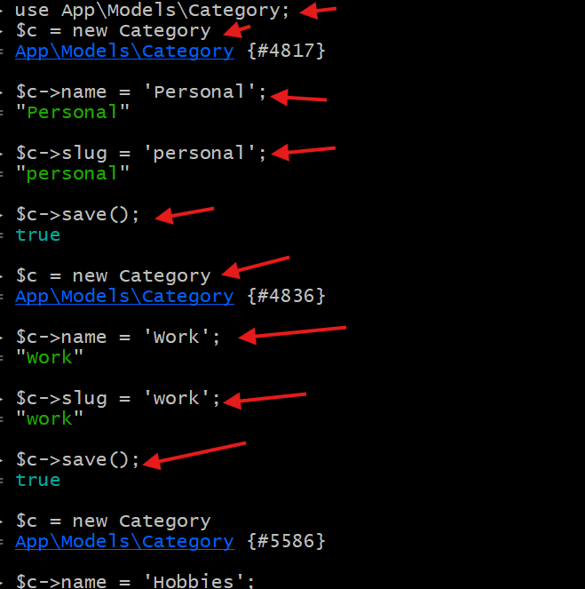
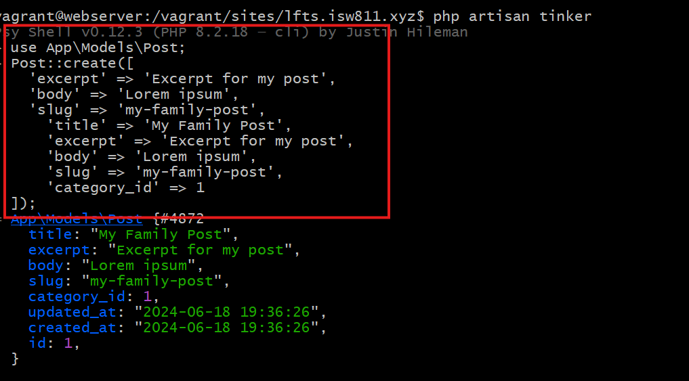

[< Volver al índice](/docs/readme.md)

# Your First Eloquent Relationship

En este episodio vamos a implementar categorÍas para los post,para empezar vamos a crear el model de categoias nos vamos a nuestro bash para ejecutar  php artisan make:migration create_categories_table con eso se creará el model y el migration.

ahora vamos a crear 3 categorÍas personal,work y hobbies.Sigamos la guia de la imagen.


Ahora vamos a editar nuestros archivos para darle formato y poder crear post y categorÍas

- Post.php (app/Models)

```php

class Post extends Model
{
    use HasFactory;

    protected $guarded = [];

    public function category()
    {
        return $this->belongsTo(Category::class);
    }
}

```

- En nuestra create post (App/migrations) agreagaremos el id de categoría
```php

public function up()
    {
        Schema::create('posts', function (Blueprint $table) {
            $table->id();
            $table->foreignId('category_id');
            $table->string('slug')->unique();
            $table->string('title');
            $table->text('excerpt');
            $table->text('body');
            $table->timestamps();
            $table->timestamp('published_at')->nullable();
        });
    }


```
- En nuestra CreateCategoriesTable (App/migrations), agregaremos el respectivo Schema

```php

    public function up()
    {
        Schema::create('categories', function (Blueprint $table) {
            $table->id();
            $table->string('name');
            $table->string('slug');
            $table->timestamps();
        });
    }
```
Despues de eliminar los post crearemos nuevos pero con el campo de slug como el ejemplo de la imagen

 


 Seguiremos esta guia para crear un post y le asignamos una categoria.


 


Por ultimo vamos a editar post y posts (resources/views) para que en la pagina se muestre la categoria y titulo

- Post.php

```php
<x-layout>
    <article>
        <h1>{{ $post->title }}</h1>

        <p>
            <a href="#">{{ $post->category->name }}</a>
        </p>

        <div>
            {!! $post->body !!}
        </div>
    </article>

    <a href="/">Go Back</a>
</x-layout>

```
- Posts.php
```php
<x-layout>
    @foreach ($posts as $post)
        <article>
            <h1>
                <a href="posts/{{ $post->slug }}">
                    {!! $post->title !!}
                </a>
            </h1>

            <p>
                <a href="#">{{ $post->category->name }}</a>
            </p>
            
            <div>
                {{ $post->excerpt }}
            </div>
        </article>
    @endforeach
</x-layout>
```
# Resumen

En este episodio, se aprendió a implementar relaciones Eloquent, específicamente una relación belongsTo entre los modelos Post y Category. Esto permitió categorizar los posts y mostrar las categorías en las vistas correspondientes. La integración de categorías mejora la organización y la navegabilidad del contenido en la aplicación web, proporcionando una estructura más clara y funcional.
