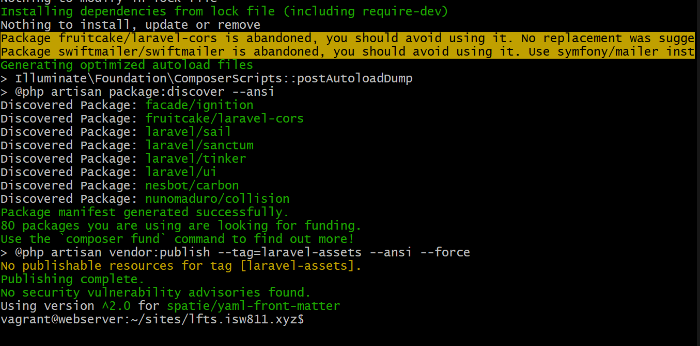
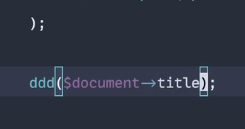
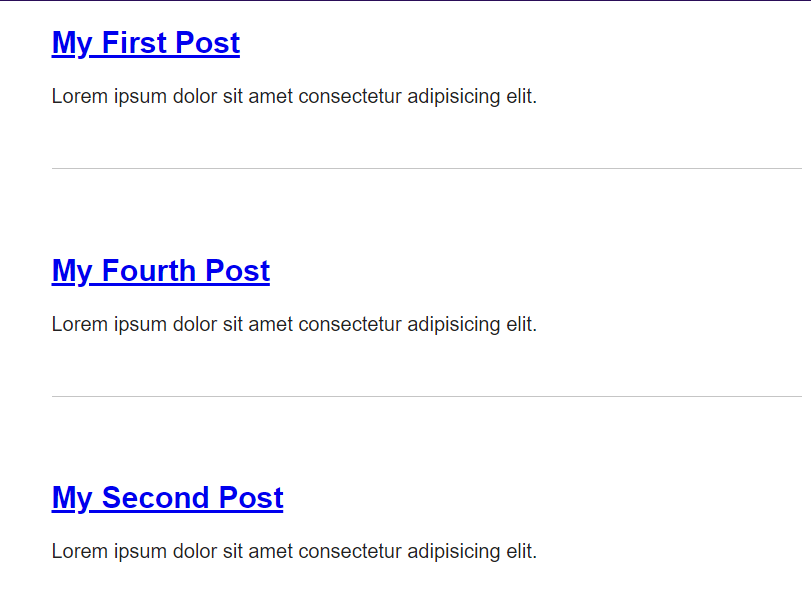
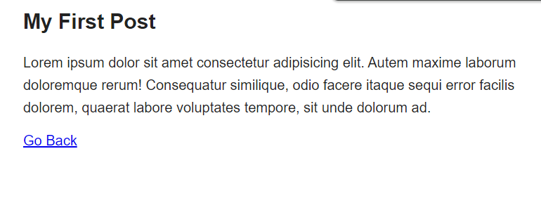

[< Volver al índice](/docs/readme.md)

#  Find a Composer Package for Post Metadata

En este episodio vamos hacer uso de Filesystem para leer un directorio. Vamos a empezar creando un `Post.php` en app/Models


Empezamos por instalar yaml `$ composer require spatie/yaml-front-matter` este comando nos facilita la manipulación 
de archivos que contienen metadatos YAML, mejorando la gestión y estructuración de datos dentro de aplicaciones PHP




Podemos ver como podemos buscar segun la estuctura que tengamos,se puede muscar mediante titulo,date y body



vamos a comenzar modificando nuestro `Post.php` en la ruta App/Models creando un contructor de la estructura que vamos a usar
para buscar.Este código nos permite leer archivos de posts con metadatos YAML, convertirlos en objetos Post y buscar posts 
específicos por su slug.

```php

<?php

namespace App\Models;

use Illuminate\Database\Eloquent\ModelNotFoundException;
use Illuminate\Support\Facades\File;
use Spatie\YamlFrontMatter\YamlFrontMatter;

Class Post
{
    public $title;

    public $excerpt;
    
    public $date;
    
    public $body;

    public $slug;

    public function __construct($title, $excerpt, $date, $body, $slug)
    {
        $this->title = $title;
        $this->excerpt = $excerpt;
        $this->date = $date;
        $this->body = $body;
        $this->slug = $slug;
    }

    public static function all()
    {
        return collect(File::files(resource_path("posts")))
        ->map(fn($file) => YamlFrontMatter::parseFile($file))
        ->map(fn($document) => new Post(
            $document->title,
            $document->excerpt,
            $document->date,
            $document->body(),
            $document->slug
        ));
    }

    public static function find($slug)
    {
        return static::all()->firstWhere('slug', $slug);
    }
}

```

Nos vamos a la ruta donde estan nuestros post y en cada uno agregaremos un title,slug,excerpt y date segun la informacion 
del post

```html
---
title: My Fourth Post
slug: my-fourth-post
excerpt: Lorem ipsum dolor sit amet consectetur adipisicing elit.
date: 2021-05-21
---

```


Ahora vamos a agregar en posts que se encuentra en resource/views `<?= $post->title; ?>` y `<?= $post->excerpt; ?>`
Este codigo nos permite construir una lista de posts estructurada y accesible para un blog

```html
<!doctype html>

<title>My Blog</title>
<link rel="stylesheet" href="/app.css">

<body>
    <?php foreach ($posts as $post) : ?>
    <article>
        <h1>
            <a href="posts/<?= $post->slug; ?>">
                <?= $post->title; ?>
            </a>
        </h1>

        <div>
            <?= $post->excerpt; ?>
        </div>
    </article>
    <?php endforeach; ?>
</body>

```


y en nuestro archivo post al darle click en el nombre mostraremos el titulo y body

```html
<!doctype html>

<title>My Blog</title>
<link rel="stylesheet" href="/app.css">

<body>
    <article>
        <h1><?= $post->title; ?></h1>

        <div>
            <?= $post->body; ?>
        </div>
    </article>
    <a href="/">Go Back</a>
</body>

```


por ultimo en nuestro archivo `web.php` modificaremos
asi podremos manejar nuestras rutas de una manera mas eficiente y amigable.

```php
Route::get('/', function () {
    return view('posts', [
        'posts' => Post::all()
    ]);
});

Route::get('posts/{post}', function ($slug) {

    return view ('post', [
        'post' => Post::find($slug)
    ]);
})->where('post', '[A-z_\-]+');


```
