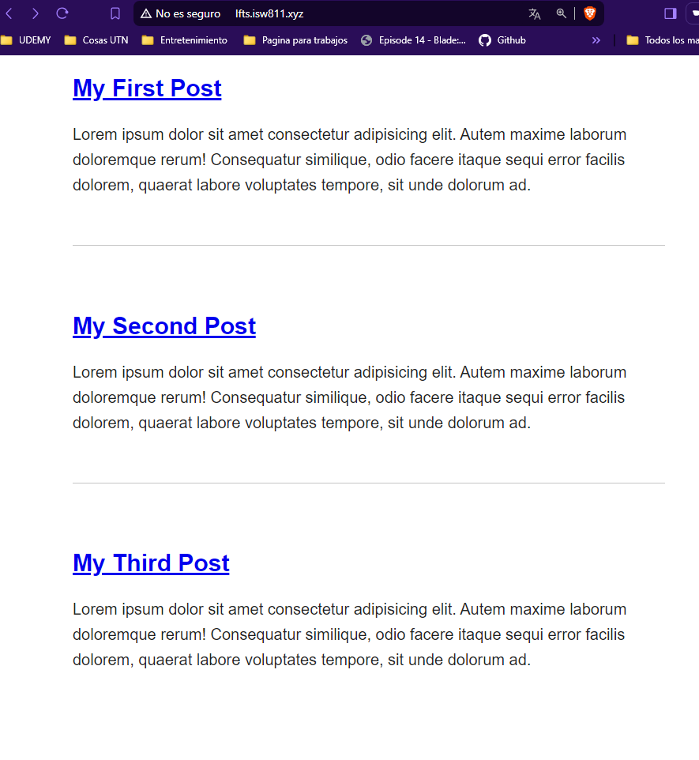

[< Volver al índice](/docs/readme.md)

#  Make a Route and Link to it

En este episodio vamos a modificar nuestro archivo web.php para llamar a nuestras paginas post.

vamos a modifarlo para que llame a post y lo muestre en la pagina.

```php
Route::get('/', function () {
    return view('posts');
});

Route::get('post', function () {
    return view('post');
});
```

luego vamos a renombrar el archivo que esta en resources/view llamado welcome por posts y agregamos un html con etiquetas  article,h1 y p Para darle formato.

```html 
<!doctype html>

<title>My Blog</title>
<link rel="stylesheet" href="/app.css">

<body>
    <article>
        <h1><a href="/post">My First Post</a></h1>

        <p>
            Lorem ipsum dolor sit amet consectetur adipisicing elit. Autem maxime laborum doloremque rerum! Consequatur similique, odio facere itaque sequi error facilis dolorem, quaerat labore voluptates tempore, sit unde dolorum ad.
        </p>
    </article>

    <article>
        <h1><a href="/post">My Second Post</a></h1>

        <p>
            Lorem ipsum dolor sit amet consectetur adipisicing elit. Autem maxime laborum doloremque rerum! Consequatur similique, odio facere itaque sequi error facilis dolorem, quaerat labore voluptates tempore, sit unde dolorum ad.
        </p>
    </article>

    <article>
        <h1><a href="/post">My Third Post</a></h1>

        <p>
            Lorem ipsum dolor sit amet consectetur adipisicing elit. Autem maxime laborum doloremque rerum! Consequatur similique, odio facere itaque sequi error facilis dolorem, quaerat labore voluptates tempore, sit unde dolorum ad.
        </p>
    </article>
</body>
```

eliminamos la alerta
```javascript
alert('I am here');
```

ahora en  resources/view creamos un archivo llamado post.

```html
<<!doctype html>

<title>My Blog</title>
<link rel="stylesheet" href="/app.css">

<body>
    <article>
        <h1><a href="/post">My First Post</a></h1>

        <p>
            Lorem ipsum dolor sit amet consectetur adipisicing elit. Autem maxime laborum doloremque rerum! Consequatur similique, odio facere itaque sequi error facilis dolorem, quaerat labore voluptates tempore, sit unde dolorum ad.
        </p>
    </article>
    <a href="/">Go Back</a>
</body>
```

Agregamos nuevos estilos para los post

```css
ons.
Filter changed files
 17 changes: 15 additions & 2 deletions17  
public/app.css
Original file line number	Diff line number	Diff line change
@@ -1,4 +1,17 @@
body {
    background: navy;
    color: white;
    background: white;
    color: #222222;
    max-width: 600px;
    margin: auto;
    font-family: sans-serif;
}

p {
    line-height: 1.6;
}

article + article {
    margin-top: 3rem;
    padding-top: 3rem;
    border-top: 1px solid #c5c5c5;
}

```



Lo que hicimos en este episodio fue crear dos html para poner post en este caso creamos una etiqueta articulo donde estara un h1 y un p para darle titulo y texto al post