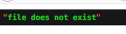
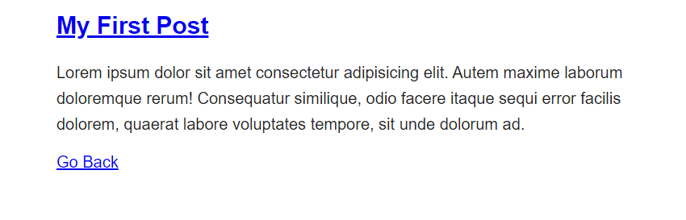

[< Volver al índice](/docs/readme.md)

#  Store Blog Posts as HTML Files

En este episodio vamos a crear una carpeta para post , modificar nuestro web.php y modificar las paginas del episodio anterior

Empezamos creando una carpeta llamada posts en resources dentro de ella vamos a crear 3 paginas html. En estas paginas nada mas agregaremos un h1 para titulo, un a href para redirigir y un p para texto

creamos 
my-first-post.html
```html
<h1><a href="/post">My First Post</a></h1>

<p>
    Lorem ipsum dolor sit amet consectetur adipisicing elit. Autem maxime laborum doloremque rerum! Consequatur similique, odio facere itaque sequi error facilis dolorem, quaerat labore voluptates tempore, sit unde dolorum ad.
</p>

```

my-second-post.html


```html
<h1><a href="/post">My Second Post</a></h1>

<p>
    Lorem ipsum dolor sit amet consectetur adipisicing elit. Autem maxime laborum doloremque rerum! Consequatur similique, odio facere itaque sequi error facilis dolorem, quaerat labore voluptates tempore, sit unde dolorum ad.
</p>
```

my-third-post.html

```html
<h1><a href="/post">My Third Post</a></h1>

<p>
    Lorem ipsum dolor sit amet consectetur adipisicing elit. Autem maxime laborum doloremque rerum! Consequatur similique, odio facere itaque sequi error facilis dolorem, quaerat labore voluptates tempore, sit unde dolorum ad.
</p>
```

ahora en post.blade.php agregaremos nuevas cosas como      <?= $post; ?> para imprimir la variable post y un go back para ir a la pagina principal 

```html
<body>
    <article>
        <h1><a href="/post">My First Post</a></h1>

        <p>
            Lorem ipsum dolor sit amet consectetur adipisicing elit. Autem maxime laborum doloremque rerum! Consequatur similique, odio facere itaque sequi error facilis dolorem, quaerat labore voluptates tempore, sit unde dolorum ad.
        </p>
        <?= $post; ?>
    </article>
    <a href="/">Go Back</a>
</body>
```

por ultimo en posts agregaremosa href para redirigir nuestros post

```html
<body>
    <article>
        <h1><a href="/post">My First Post</a></h1>
        <h1><a href="/posts/my-first-post">My First Post</a></h1>

        <p>
            Lorem ipsum dolor sit amet consectetur adipisicing elit. Autem maxime laborum doloremque rerum! Consequatur similique, odio facere itaque sequi error facilis dolorem, quaerat labore voluptates tempore, sit unde dolorum ad.
        </p>
    </article>

    <article>
        <h1><a href="/post">My Second Post</a></h1>
        <h1><a href="/posts/my-second-post">My Second Post</a></h1>

        <p>
            Lorem ipsum dolor sit amet consectetur adipisicing elit. Autem maxime laborum doloremque rerum! Consequatur similique, odio facere itaque sequi error facilis dolorem, quaerat labore voluptates tempore, sit unde dolorum ad.
        </p>
    </article>

    <article>
        <h1><a href="/post">My Third Post</a></h1>
        <h1><a href="/posts/my-third-post">My Third Post</a></h1>

        <p>
            Lorem ipsum dolor sit amet consectetur adipisicing elit. Autem maxime laborum doloremque rerum! Consequatur similique, odio facere itaque sequi error facilis dolorem, quaerat labore voluptates tempore, sit unde dolorum ad.

```

modificamos el web.php para que la a ruta principal muestra la vista posts, mientras que la ruta posts/{post} construye y lee un archivo basado en el $slug, mostrando su contenido en la vista post o redirigiendo a la página principal si no existe. con el ´$slug´ podemos poner la ruta de como se llama el post en el link de la página
```php

Route::get('/', function () {
    return view('posts');
});

Route::get('posts/{post}', function ($slug) {
    $path = __DIR__ . "/../resources/posts/{$slug}.html";

    if (! file_exists($path)) {
        return redirect('/');
        //abort(404);
    }

    $post = file_get_contents($path);

    return view('post', [
        'post' => $post
    ]);
});

```

podemos usar esto para mostar errrores en la pagina

```php
ddd('file does not exist')

o
abort(404);

```




En resource/view agregamos un php llamado post donde se llamara el contenido del post y se mostrará en la pagina ademas agregamos un link para go back
```php
<!doctype html>

<title>My Blog</title>
<link rel="stylesheet" href="/app.css">

<body>
    <article>
        <?= $post; ?>
    </article>
    <a href="/">Go Back</a>
</body>


```




En conclusion en este episodio se crearon nuevas paginas en post para poder tener variedad y mostrarla en la pagina principal donde en cada post se agrego un a href para que al darle click nos redireccione a la pagina del post